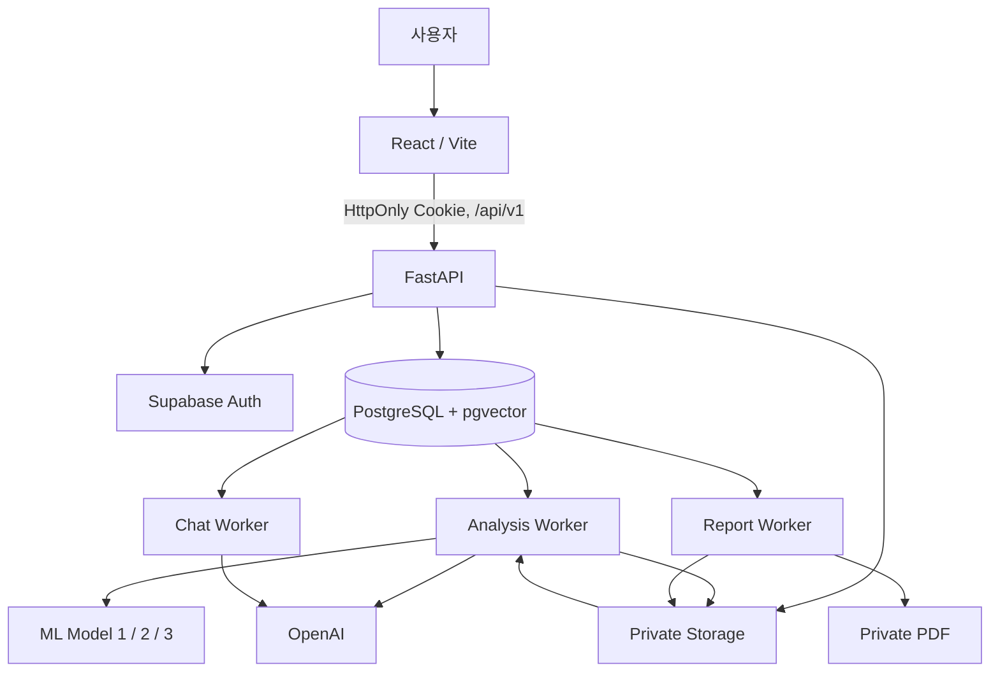

<div align="center">


# PreReview

### 중소기업 지원사업 사전협의 요청서의 작성 항목·내부 정합성·유사 사업 후보를 확인하는 AI 기반 검토 보조 서비스

HWP/HWPX 요청서를 업로드하면 근거와 함께 CPL, FIT, SIM 및 모델 분석 결과를 제공합니다.

> CPL·FIT·SIM은 팀 내부 알파 기준입니다. 실제 SIMS나 행정기관의 최종 판단을 대체하지 않으며, 사업의 중복·적격성·법적 또는 정책적 타당성을 확정하지 않습니다.


</div>

---

## 목차

1. [프로젝트 개요](#프로젝트-개요)
2. [개발 배경](#개발-배경)
3. [핵심 기능](#핵심-기능)
4. [기술 스택](#기술-스택)
5. [시스템 아키텍처](#시스템-아키텍처)
6. [핵심 기술](#핵심-기술)
7. [검증 현황](#검증-현황)
8. [프로젝트 구조](#프로젝트-구조)
9. [실행 방법](#실행-방법)
10. [상세 문서](#상세-문서)
11. [향후 보완](#향후-보완)

---

## 프로젝트 개요

**PreReview**는 신규·변경 중소기업 지원사업의 사전협의를 준비하는 사업기획 담당자를 위한 검토 보조 서비스입니다. 요청서의 주요 정보와 항목 간 연결성을 확인하고, 공개된 기존 지원사업에서 먼저 살펴볼 유사 후보를 찾습니다. 분석 결과에는 상태와 원문 근거(Evidence)를 함께 보존합니다.

```text
요청서 업로드 → HWP/HWPX 파싱 → CPL·FIT 분석 → 유사 공고 검색·SIM 비교
                                                └→ ML 1/2/3 분석
                                                     → 결과 조회·PDF·AI 질의응답
```

## 개발 배경

지원사업 사전협의 문서는 목적, 대상, 지원내용, 예산·규모, 수행체계 등 여러 항목이 서로 일관되어야 합니다. PreReview는 문서 작성 단계에서 확인이 필요한 정보를 찾고, 문서 내 관계를 점검하며, 공개 공고와 구조적으로 비교할 수 있는 검토 흐름을 제공합니다. 검색된 후보는 검토 우선순위를 돕기 위한 것이며 자동 중복 판정이 아닙니다.

## 핵심 기능

| 기능 | 설명 | 결과 |
|:---|:---|:---|
| **요청서 업로드** | HWP/HWPX의 확장자·파일 형식·크기를 확인하고 private Storage에 저장 | 비동기 분석 run 생성 |
| **CPL 분석** | 요청서의 13개 확인 항목과 원문 근거를 구조화 | 항목별 상태·근거·경고 |
| **FIT 분석** | 목적·대상·지원내용·성과·수행체계 등의 관계를 비교 | 7개 관계 판정 |
| **SIM 분석** | pgvector로 유사 공고를 검색하고 목적·대상·지원내용·수행체계를 비교 | 후보별 비교 결과 |
| **ML 분석** | 지원성격 분류, 비교군 내 지원규모 상대 위치, 설계 이례성을 계산 | Model 1/2/3 결과 |
| **AI 질의응답** | 저장된 분석 결과와 Evidence만 근거로 답변 생성 | 대화·참조 근거 |
| **PDF 보고서** | PDF queue 지원 대상 분석 결과를 private PDF로 렌더링 | 소유자 확인 다운로드 |
| **이력·세션 관리** | 사용자별 분석 이력과 활성 분석 세션 제공 | cursor 기반 이력 조회 |

## 기술 스택

| 구분 | 기술 |
|:---|:---|
| **Frontend** | React 19, TypeScript, Vite 8, React Router, Tailwind CSS |
| **Backend** | Python 3.11+, FastAPI, Pydantic, Uvicorn |
| **Data & Auth** | Supabase Auth, PostgreSQL 17, pgvector, private Storage |
| **AI** | OpenAI, LangGraph, `text-embedding-3-small` |
| **Workers** | PostgreSQL polling queue, analysis worker, chat worker, report worker |
| **ML** | KLUE-BERT 기반 분류, 지원규모 상대 비교(보조 회귀 추정), 거리 기반 이례성 분석 |
| **Infra** | Docker Compose, Chromium PDF rendering, Caddy 정적 배포 |
| **Test** | pytest, ESLint, TypeScript build, Docker external E2E |

## 시스템 아키텍처



브라우저는 FastAPI만 호출하며 Supabase, PostgreSQL, Storage, OpenAI 자격증명은 서버와 worker 내부에서만 사용합니다. 작업자는 PostgreSQL queue를 polling하며, 분석·채팅·PDF 생성을 분리해 처리합니다.

## 핵심 기술

### Evidence 기반 분석 결과

CPL·FIT·SIM은 결과값만 저장하지 않고 해당 원문의 Evidence를 함께 보존합니다. 서버는 CPL의 `evidence_ref`·원문 포함 여부·허용 축을 검증하고, FIT·SIM에서는 관계와 비교 축이 허용된 입력 근거를 참조하는지 검증합니다. 근거 부족이나 응답 오류는 정상 결과를 덮어쓰지 않고 상태·reason code·warning으로 남깁니다.

### 비동기 worker와 fenced 처리

업로드는 `queued` run을 생성하고, PostgreSQL의 `FOR UPDATE SKIP LOCKED` 기반 queue가 작업을 claim합니다. lease와 heartbeat, `processing_run` fencing token으로 지연된 worker가 최신 결과를 덮어쓰지 못하도록 합니다.

### 유사 공고 검색과 SIM 비교

기존 공고와 요청서를 목적·대상·지원내용·수행체계의 공통 비교 프로필로 변환합니다. 준비된 축만 임베딩해 pgvector 검색을 수행하며, SIM 핵심 축이 충분히 평가되지 않으면 점수 대신 `ON_HOLD`로 결과를 보존합니다.

### private PDF 및 근거 기반 채팅

report worker는 PDF queue에 등록된 분석 결과를 오프라인 HTML 템플릿으로 Chromium 렌더링해 private Storage에 저장합니다. chat worker는 저장된 분석 결과와 case 범위 Evidence를 근거로 답하고, API는 소유권을 확인한 뒤 결과와 PDF를 제공합니다. PDF 기능 적용 전에 완료된 분석은 재분석되지 않는 한 소급 생성하지 않습니다.

## 검증 현황

- 2026-09-14 Linux/Docker 기준 전체 backend pytest: **903 passed, 3 skipped**
- 2026-09-17 HWPX Docker external E2E: analysis·chat·ML 1/2/3과 PDF 생성·다운로드 확인

검증 수치는 해당 시점의 기록이며 현재 release를 자동으로 보증하지 않습니다. 입력, 실행 환경과 상세 결과는 [구현·검증 기록](backend/IMPLEMENTATION_STATUS.md)을 확인하세요.

## 프로젝트 구조

```text
SKN30-FINAL-4Team/
├─ backend/       FastAPI, analysis/chat/report workers, Supabase migration, API 계약
├─ frontend/      React 사용자 화면과 Caddy 배포 설정
├─ ml/            모델 학습·평가·serving artifact 및 재현 파이프라인
├─ docs/          기획, 운영, 검증 문서
├─ samples/       HWP/HWPX 샘플과 기대 결과
├─ scripts/       개발·검증 보조 스크립트
└─ README.md
```

## 실행 방법

### 프론트엔드 개발 서버

```bash
cd frontend
npm ci
npm run dev
```

개발 서버는 `http://localhost:3000`에서 실행되며 `/api/v1` 요청을 기본적으로 `http://localhost:8001`로 프록시합니다.

### 백엔드 API 확인

```bash
cd backend
uv sync --frozen --extra dev
uv run uvicorn main:app --reload --host 127.0.0.1 --port 8001
```

환경 파일 없이 실행하는 API는 OpenAPI와 정적 계약 확인용 fail-closed 모드입니다.

### 백엔드 API·worker Compose 실행

이 Compose는 API와 analysis·chat·report worker를 실행하며 Supabase 전체를 기동하지 않습니다. 먼저 Supabase/PostgreSQL/Storage, OpenAI 설정, 검증된 Model 1 runtime과 `PREREVIEW_MODEL1_SERVING_HOST_DIR`, `PREREVIEW_MODEL1_RUNTIME_UID`, `PREREVIEW_MODEL1_RUNTIME_GID`를 준비해야 합니다. [백엔드 실행·API 개요](backend/README.md)의 준비 절차를 따르고 비밀값은 커밋하지 마세요.

```bash
cd backend
docker compose up -d --build
docker compose ps
```

## 상세 문서

- [백엔드 실행·API 개요](backend/README.md)
- [백엔드 구현·검증 기록](backend/IMPLEMENTATION_STATUS.md)
- [FastAPI 프론트엔드 API 명세](backend/fastapi/docs/0.FASTAPI_FRONTEND_API_SPEC.md)
- [Supabase DB 구성·복구](backend/supabase/DATABASE_SETUP_GUIDE.md)
- [프론트엔드 개발·빌드](frontend/README.md)
- [프론트엔드 배포(Caddy)](frontend/deploy/README.md)
- [ML 구조·재현 점검](ml/README.md)

## 향후 보완

- 실제 Hancom HWP/HWPX와 malformed·timeout 문서에 대한 E2E 범위 확대
- retention cleanup과 worker queue lag를 포함한 운영 readiness 보강
- 일부 비교 축이 부족한 요청에 대한 결과 정책 고도화
- OpenAI 호출 단위 감사 기록 연결

## 보안 유의사항

- `.env`, API key, DB URL, Model 1 runtime은 Git에 포함하지 않습니다.
- private Storage와 PostgreSQL은 브라우저에서 직접 접근하지 않습니다.
- 운영 환경의 구성·권한·복구는 상세 문서에 따라 별도로 검증합니다.
