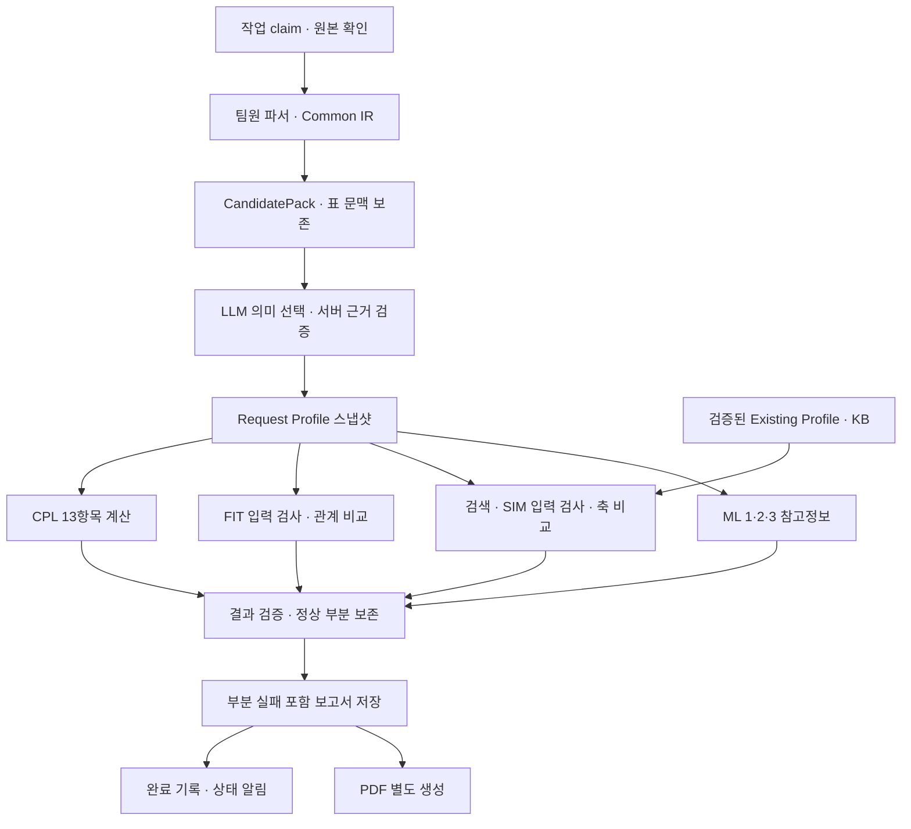
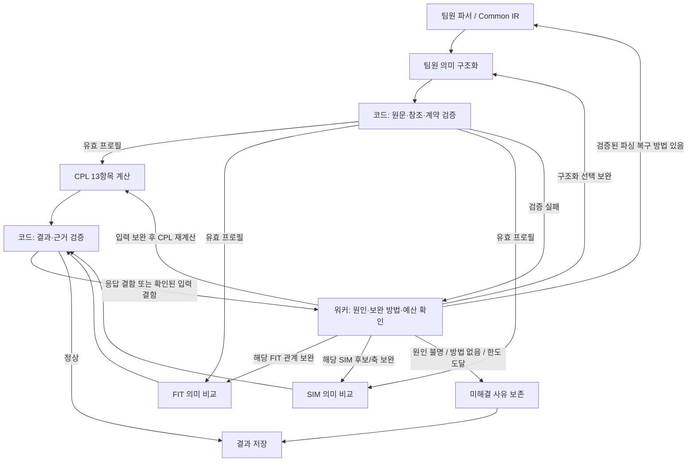

# Pre-review 백엔드 코드베이스 재설계 초안 v0.2

- 작성일: 2026-09-07
- 상태: 검토용 설계 초안. 구현·DB 변경·배포 승인을 의미하지 않는다.
- 범위: 코드 구성, 모듈 책임과 입출력, 기존 코드 재사용, 실행·재검·저장 흐름, 구현 순서.
- 이번 작업: 문서만 작성한다. 기존 코드·스키마·외부 전달 자료는 변경하지 않는다.
- 기존 `Pre-review_백엔드_재설계_초안_v0.1_260907.md`는 보존한다. 이번 대화에서 새로 합의한 사항과 구분해 읽는다.
- 갱신: 2026-09-07 2차. LLM·임베딩 모두 자체 운영 모델 사용으로 확정해 §1.1·§11·§15의 임베딩 미확정 문구를 정정했다. 각각 교체 가능한 포트 경계로 두고 모델·주소·차원은 환경변수와 DB 행으로 받는다.
- 갱신: 2026-09-07 테스트 기록 검토 후 합의 반영. 비교 전 입력 검사, 오류별 보완·종료 조건, 단계별 원인 추적, 품질 평가 계획을 통합했다. 기존 링크를 유지하기 위해 파일명과 문서 버전은 유지한다.

이번 갱신으로 구조 설계와 단계별 구현을 시작할 기준을 정한다. 프롬프트 정확도·실제 보완 효과·운영 시간 한도는 구현 후 실제 문서로 검증할 항목이다. 설계가 정해졌다는 것과 판단 품질이 검증됐다는 것은 구분한다.

## 1. 설계 기준과 결정 상태

### 1.1 사용자와 합의한 방향

| 항목 | 현재 기준 |
|---|---|
| 웹 백엔드 | FastAPI 없이 Supabase·Edge Function·Python 워커로 구성한다. |
| 파서 | 팀원 Common IR Pipeline을 반드시 채택한다. |
| 의미 구조화 | 팀원 Request/Existing Profile 구현을 기반으로 연결한다. 검증된 추출을 기존 CPL 추출기로 반복하지 않는다. |
| DB | 팀원 제공 Supabase 스키마를 기반으로 사용하고 필요한 접근·실행·검색 경계를 보완한다. |
| CPL | **기존 13개 항목**을 사용한다. 전달 문서의 17개 안은 이번 확정사항으로 대체한다. |
| 사실 보존 | 하위 필드의 사실·근거·누락 상태를 각각 보존한다. 다른 필드의 값으로 누락을 채우지 않는다. |
| FIT | 관계에 필요한 좌우 근거가 모두 확보돼야 비교한다. 한쪽이라도 없으면 정보 부족이다. |
| 재검 | 추출·접지·의미 분류 미완료만 제한적으로 보완한다. 낮은 점수·실제 누락·실제 모순 자체는 재검 사유가 아니다. |
| 모델 서버 | 팀원이 RunPod에서 운영하는 vLLM·Gemma 4를 사용한다. 정확한 배포 모델 ID·버전은 연결 시 확인한다. |
| 임베딩 | **자체 운영으로 확정한다.** 같은 vLLM 인스턴스의 `/v1/embeddings`를 사용한다. 외부 임베딩 API는 쓰지 않는다. 모델명·차원은 연결 시 확인한다. |
| ML | 모델 1·2·3의 결과를 각각 한 줄의 참고정보로 제공한다. CPL/FIT/SIM 판정이나 검색 후보 제한에 우선 반영하지 않는다. |
| 화면 | 점수·퍼센트 대신 상태·설명·원문 근거를 표시한다. ML은 지원유형·예측 금액·이례성 설명을 제공하고 확률·점수는 숨긴다. |
| 부분 실패 | 정상 결과를 보존하고 실패한 분석 부분의 상태와 사유를 제공한다. |
| 검증 | 같은 실제 문서로 추출·접지·판단 품질, 실행시간, 재검 효과를 비교한다. |

### 1.2 잠정안과 확인할 사항

후속 합의에 따라 아래 의미 품질·표시 집계의 세부 미결정사항은 전체 연결 구현의 선행 차단 조건으로 삼지 않는다. 팀원 프로필 정의와 검증 계약으로 먼저 연결하고, 실제 출력으로 개선한다. 단, 근거를 만들거나 미확정 정책을 확정 판정으로 위장하지 않는다. 삭제·권한·운영 데이터 변경은 해당 기능 적용 전에 별도로 확인한다.

- Supabase 자체 호스팅은 자료의 전제이며 사용자도 그 방향으로 이해하고 있다. 실제 Auth·Storage·Realtime·Edge Runtime까지 구동하는지는 미확인이다.
- FIT 7관계·SIM 4축을 출발점으로 삼는다. 상세 판정 의미·그룹·문구 변경은 별도 계약 검토 대상이다.
- 의미 보완은 대상별 기본 1회를 제안한다. 전체 호출·시간 예산은 실제 실행 결과 후 정한다.
- SIM의 종료 공고 포함, 약 20개 검색 후 5개 표시, 최종 순위 산식은 제품 문서의 제안으로 두고 확정하지 않는다.
- 원본·중간물 성공 후 정리, 결과·PDF·대화 90일 보관, 과거 이력의 채팅 열람 전용은 전달 문서의 정책 제안이다. 삭제 기능 구현 전 사용자 확인이 필요하다.
- 인증 만료 시간, 활성 분석 세션, PDF 재시도 횟수, 워커 heartbeat 간격·실행 한도 역시 제품 문서의 운영안이다. 코드에 먼저 고정하지 않는다.
- 점수를 숨긴다고 검색 순위 계산까지 없애지는 않는다. 사용자 표시와 내부 검색·평가 지표는 분리한다. 불필요한 CPL/FIT 종합 점수는 새로 만들지 않는다.

## 2. 확인한 코드·자료와 검증 한계

| 자료 | 확인한 범위와 용도 |
|---|---|
| 현재 저장소 `이동욱`, HEAD `2269f40` | FastAPI 진입점, 분석 파이프라인, CPL/FIT/SIM 경계, PDF·저장·테스트 구성. 재사용 후보의 기준이다. |
| GitHub `develop_multi`, `bb0163e7c0b85fd028e632ed99d2245a7090ce18` | ML 추론 진입점·평가 산출물·모델 배포 경계. 브랜치를 전환하거나 병합하지 않고 읽었다. |
| [Common IR 인수인계](C:/Users/playdata2/Downloads/common_ir_pipeline/HANDOVER.md) | 문서 파싱, Common IR, 원문·셀·관계·출처 보존 계약. |
| [프로필 구조화 패키지](C:/Users/playdata2/Downloads/portable_existing_request_profiles_20260831/README.md) | CandidatePack, 모델 선택, 서버의 원문 구간 검증, Request/Existing 조립 코드. |
| [Request 계약·예시](C:/Users/playdata2/Downloads/request_profile_v0.1.2_markdown_fixture_contract_and_examples_20260904/README.md) | Markdown fixture 기반 계약 예시. 실제 HWP/HWPX 또는 의미 정답셋으로 취급하지 않는다. |
| [팀원 DB 자료](C:/Users/playdata2/Downloads/backend/DATA_RETENTION_ARCHITECTURE.md) | Supabase DDL·권한·보관 구조. 문서 수치보다 실제 SQL을 검증 기준으로 삼는다. |
| [PoC 제품·데이터 방향](<C:/Users/playdata2/Downloads/POC_PRODUCT_AND_DATA_DECISIONS (1).md>) | 화면·업로드·인증·결과·대화 목표. 이번 사용자 확정사항과 충돌하면 이번 결정을 우선한다. |

이 문서는 코드·계약에 근거한 설계이며 새 구조의 성능 보증이 아니다. 실제 DB 마이그레이션, HWP→새 프로필→판정 전체 실행, Gemma 호출, ML 재평가는 이번 문서 작성에서 수행하지 않았다. 전달 파일의 지시 문구·실험 기록을 사용자 승인이나 최신 확정 계약으로 자동 승격하지 않는다.

### 2.1 이전 백엔드 테스트 기록이 설계에 미친 영향

검토 자료는 [과거 실행 기록](C:/Users/playdata2/Desktop/테스트셋/Pre-review_과거_분석실행_기록_v1.0_260904.md), [파싱 동작·출력](C:/Users/playdata2/Desktop/테스트셋/Pre-review_파싱_현행동작과_출력_v1.0_260904.md), [판정실패 원인분석](C:/Users/playdata2/Desktop/테스트셋/Pre-review_판정실패_원인분석_v1.0_260904.md) 및 같은 폴더 DB 설명의 관련 절이다. 아래 수치는 보고서에 기록된 관찰이며 이번 작업에서 원본 재실행이나 DB 재조회로 재현한 측정값이 아니다. 폴더 자체는 원본·정답·실행 산출물이 완비된 골든셋이 아니다.

| 기록된 현상 | 해석의 한계 | 설계 반영 |
|---|---|---|
| 파싱 51건 중 39건 부분 성공, 표 셀의 필드 귀속 미확정 반복 | 부분 성공과 귀속 실패의 동반 발생만으로 파서 자체가 원인이라고 확정할 수 없다. | 원본→Common IR→후보→선택→프로필을 연결해 문맥 소실 위치를 확인한다. |
| 요청유형 체크에서 private-use 문자 U+F0FE 관련 모호성 | 이 코드포인트는 글꼴에 따라 다를 수 있다. 항상 선택된 체크로 치환하면 안 된다. | 원본 표시·글꼴 의미가 확인된 변환만 적용하고 미확인 표시는 보류한다. LLM 반복으로 추정하지 않는다. |
| 10건의 실행에서 41개 CPL 항목에 타임아웃 사유 기록 | 41회 외부 호출 실패를 뜻하지 않는다. 배치 호출의 영향이 여러 항목에 나타난 것이다. | 호출 ID와 영향 항목을 연결하고 통신 재시도·의미 보완을 분리한다. |
| 추진계획 51건 모두 확인 필요 | 상태가 일정하다고 정확한 것은 아니다. 문서 부족·분류·적용 조건·정책 문제를 구별해야 한다. | 연차별/내역사업별 적용 근거, 내용 근거, 구조화 상태, 정책 판단을 분리한다. |
| FIT-4 47건 모두 비교 불충분 | 비교 기준 미확보에 따른 의도된 동작이다. | 정책 미정은 루프에서 제외한다. |
| FIT-7 47건 모두 비교 불충분 | 양측 부재·단측 값·정규화 실패 등 실제 관계 입력을 확인해야 원인을 좁힐 수 있다. | 의미·기간·단위·범위를 사전 검사하고 실패 이유를 분리한다. |
| SIM 지원내용 230건 모두 비교 불충분, 응답 오류 기록 | 기존 오류는 잘못된 ref·필수 설명 누락·양쪽 인용 미충족 등을 묶는다. 자료 부족으로 단정할 수 없다. 공고 6개와 반복 요청서이므로 230개의 독립 표본도 아니다. | 입력 부족과 응답 결함을 구분하고 실패한 후보/축만 보완한다. |

따라서 Supabase·Python 워커·팀원 파서/프로필이라는 큰 구조는 유지한다. 루프 횟수 확대나 상시 진단 LLM 추가보다 입력 준비, 진단 구체화, 정상 결과 보존을 먼저 구현한다. 팀원 파서 교체만으로 위 문제가 해결됐다고 간주하지 않는다.

## 3. 목표 실행 구조

```text
React
  ├ Supabase Auth: 인증
  ├ Storage: 허용된 본인 경로에 업로드
  ├ View/RPC: 본인 상태·결과·이력·대화 조회
  ├ Realtime: 상태 변경 알림
  └ Edge Function: 작업 접수·질문 등록·PDF 다운로드 권한 확인
                         ↓
Supabase DB / Storage / 작업 등록
                         ↓
Python 워커: claim → 검증 → 분석 → 결과 저장 → 완료 기록
  ├ 팀원 파서·프로필 구조화
  ├ CPL / FIT / Retrieval / SIM
  ├ ML 1 / 2 / 3 참고정보
  ├ 결과 조립 / PDF / 결과 기반 채팅
  └ 필요한 의미 작업 → RunPod vLLM / Gemma 4
```

공고 수집은 사용자 요청서 실행과 분리한다.

```text
공고 원천 → 수집·버전 식별 → 팀원 파서 → Existing Profile
         → 검증·KB 적재 → 검색용 텍스트·벡터 준비
```

- 워커는 HTTP 서버 없이 작업을 가져온다. 웹 요청을 처리하는 책임은 Supabase의 제공 기능과 제한된 Edge Function에 둔다.
- Realtime은 알림 수단이다. 상태의 기준은 DB이며 재접속 시 현재 상태를 다시 읽는다.
- 하나의 Python 코드베이스에서 시작한다. 그림의 에이전트 박스 수만큼 서버·프로세스·LLM 호출을 만들지 않는다.
- FIT 그룹 분할·SIM 축별 호출 분할은 입력 계약과 품질·지연 평가 후 선택한다. 오케스트레이션·집계는 일반 코드가 맡는다.



검증 실패의 보완 경로는 9절을 따른다. 분석 호출 전에 입력을 검사하고, 응답을 받은 뒤 해당 입력 계약으로 다시 검증한다. ML 실패나 Retrieval 실패가 유효한 CPL/FIT 결과의 저장을 막지 않도록 한다.

## 4. 제안 코드베이스 배치

아래 파일명은 제안이다. 이 문서 작성으로 실제 폴더를 만들거나 기존 파일을 이동하지 않는다.

```text
backend/
  worker/
    main.py                 # 작업 수신·종료·동시 처리 제한
    analysis.py             # 분석 순서·재검 예산·부분 실패 통제
    jobs.py                 # claim·heartbeat·완료·실패 기록
    profiles.py             # 팀원 파서/구조화 패키지 호출·결과 검증
    analysis_inputs.py      # Profile → CPL/FIT/SIM/ML 입력 매핑
    cpl.py                  # 13항목 판정, 하위 필드 상태 보존
    fit.py                  # 좌우 근거 확인 및 관계 비교
    retrieval.py            # KB 후보 검색
    sim.py                  # 요청서·후보 프로필 비교
    ml_reference.py         # 세 모델 호출 및 참고 출력 변환
    reporting.py            # 결과 DTO·근거 스냅샷 조립
    pdf.py                  # 확정 결과 기반 PDF 생성·재생성
    chat.py                 # 저장된 결과·근거 기반 답변
    persistence.py          # 필요한 DB 조회·저장·트랜잭션
    contracts/              # 기능별 입출력 DTO
    adapters/               # LLM·임베딩·Storage·PDF 외부 경계
  config/
    prompts/                # 버전 있는 의미 구조화·FIT·SIM·채팅 프롬프트
  tests/
  supabase/
    migrations/             # 팀원 SQL 기반 + 검토된 추가 migration
    functions/              # 작업·질문 접수, PDF 다운로드 등

packages/
  common_ir_pipeline/       # 팀원 파서 원본 기반
  profile_structuring/      # 팀원 semantic_structuring 원본 기반

ml/                         # develop_multi의 학습·추론 코드와 artifact 관리
```

- 팀원 패키지는 전달 버전·해시·출처를 기록해 편입한다. 기존 import 경로가 전제하는 구조를 먼저 보존하고, 패키징 변경은 동작 확인 후 한다.
- ML의 feature engineering을 워커에서 다시 작성하지 않는다. 기존 전처리·열 순서·범주 코드·모델 버전을 재사용한다.
- 데이터 테이블마다 Repository를 만들지 않는다. 반복 조회와 트랜잭션 단위가 실제로 커질 때만 저장 모듈을 분리한다.
- 공통화 범위는 근거·버전·실행 진단으로 제한한다. CPL/FIT/SIM/ML 결과를 하나의 거대한 nullable DTO로 합치지 않는다.

### 4.1 후속 변경을 좁은 범위로 제한하는 구현 원칙

구현은 Luna max, 최종 계약 리뷰·통합 판단·검증은 메인 에이전트가 담당한다. 구현 모델을 사용하지 못하면 임의로 다른 모델로 대체하지 않고 알린다.

| 변경 가능성이 큰 부분 | 우선 둘 위치 | 변경 시 확인할 범위 |
|---|---|---|
| 필드 설명·원문 선택·의미 비교 지침 | 버전 있는 프롬프트 파일 | 실제 payload와 출력 검증·의미 평가 |
| Profile → CPL 13항목 연결 | `analysis_inputs.py`의 명시적 매핑 | 하위 Fact·근거·누락 보존 계약 |
| CPL 대표 상태·적용 조건 | `cpl.py`의 항목별 일반 함수/정책 | 상태 집계 테스트와 화면 계약 |
| FIT 관계·SIM 비교 입력 | 기능별 입력 구성 함수 | 좌우 근거·소속·참조 검증 |
| 오류별 보완 경로·예산 | 워커 제어 함수와 작은 설정 | 허용 경로·횟수·종료·정상 결과 보존 |
| 표시 문구·그룹 | 결과 표시 변환 | 화면과 PDF 의미 일치 |
| 새 필드·결과 구조 | 기능별 DTO·Profile 계약 | 버전·생산자/소비자·필요시 migration |

- 범용 규칙 엔진, 플러그인 시스템, 모든 함수의 인터페이스화를 만들지 않는다. 이미 바뀔 이유가 확인된 경계만 분리한다.
- 파서·구조화·판정·표시·DB 저장을 서로 직접 수정하는 구조로 묶지 않는다. LLM이 DB나 다른 분석 결과를 직접 갱신하지 않는다.
- 최초 구현에서 확인하지 못한 하위 정보는 미확정/실패 진단과 함께 보존한다. 미래 규칙을 예상해 원문에 없는 값을 채우지 않는다.
- 전달 패키지 원본과 통합 코드를 구분한다. 패키지 자체 수정이 필요하면 변경 이유·입력 사례·검증을 남긴다.
- 사실·근거·버전을 보존해 재분석 가능성을 확보하되, 승인된 보관기간을 넘어 원본을 보관하거나 이미 삭제한 원본을 복구할 수 있다고 가정하지 않는다.
- 필드 추가·판정 의미 변경·저장 구조 변경은 프롬프트 수정만으로 처리하지 않는다. 별도 계약·회귀 검증 대상이다.

## 5. 핵심 데이터 계약

### 5.1 원문에서 프로필까지

| 단계 | 입력 | 출력 | 책임 |
|---|---|---|---|
| Parser | 원본 파일·출처·해시 | Common IR v1 | 문단·표·셀·명시적 관계 보존. 업무 판단을 만들지 않는다. |
| CandidatePack | 검증된 Common IR | 선택 가능한 원문 후보·lineage | 표 전체를 평탄화해 값 후보로 쓰지 않고 셀 문단 단위를 보존한다. |
| Semantic selector | 후보·필드 계약·읽기 전용 문맥 | 근거 locator 선택 | 의미 분류 및 관계 선택. 최종 원문·좌표·정규값을 임의 생성하지 않는다. |
| Materializer/validator | 모델 선택·동일 CandidatePack | 검증된 Request/Existing Profile | 실제 연속 원문 구간 복원, 출처·소속·참조 검증. |
| Analysis input mapping | 프로필·원문 참조 | 기능별 비교 입력 | 기존 판정이 요구하는 의미와 근거를 연결한다. 없는 축은 만들지 않는다. |

`value_raw`는 CandidatePack의 실제 원문 구간에서 복원한다. Common IR ID와 CandidatePack ID는 다른 namespace이며 문서 간 전역 ID로 간주하지 않는다. 프로필 ID, 원본 해시, CandidatePack 생성 버전, 원문 위치의 연결을 보존한다.

팀원 PDF 경로는 native text만 의미 근거로 사용한다. OCR/Surya의 진단 결과를 사실 추출 텍스트로 자동 사용하지 않는다. Markdown fixture의 성공으로 실제 HWP/HWPX 병합 셀·중첩 표 검증을 대체하지 않는다.

### 5.2 분석 결과 계약

**팀원 프로필의 필드 정의가 의미 구조화의 출발점이다.** LLM은 그 정의에 따라 원문을 분류하고, 기존 백엔드의 세부 축에 맞추려고 새로운 사실을 생성하지 않는다. 기존 코드는 이 프로필에 의미가 맞는 부분만 재사용한다. 기존 DTO를 그대로 유지하는 것 자체를 목표로 삼지 않는다.

- `CplResult`: 13개 항목, 하위 필드별 사실·상태·근거·사유.
- `FitResult`: 관계별 좌우 근거, 비교 가능 여부, 상태·사유.
- `SimComparisonResult`: 후보별 비교 축, 공통점·차이·근거·비교 불가 사유.
- `MlReferenceResult`: 모델별 결과·사용한 입력 출처·버전·사용 불가 사유. 예측을 원문 사실과 구분한다.
- `ReportResult`: 사용자에게 제공할 분석 내용과 독립 근거 스냅샷.
- `ChatAnswer`: 답변과 저장된 근거 참조.

정확한 JSON 필드명·상태 enum은 계약 단계에서 고정한다. 화면 label과 내부 의미 코드를 분리해 문구 변경이 판정 구현 변경으로 번지지 않게 한다.

## 6. 기존 CPL 13항목과 팀원 프로필의 1차 대응

아래는 연결 후보이며 항목별 최종 충족·적용 제외 조건은 아니다. 팀원 필드 정의로 우선 연결하고 하위 상태를 보존한다. 집계가 미확정인 항목은 그 사실을 명시하며, 여러 필드 중 무엇이 필수·대체·선택인지는 실제 출력 검토로 보완한다. 이 세부 결정 때문에 파서·프로필·분석 전체 연결을 미루지 않는다.

| 기존 코드 | 프로필 연결 후보 | 확인할 사항 |
|---|---|---|
| REQUEST_TYPE | `request_type` | 서버 체크박스 결과 사용. 미해결 체크를 LLM이 추정하지 않는다. |
| PURPOSE_GOAL | `comparison_profile.purpose_goal` | FIT이 요구하는 목적 방향·대상 조건 등 세부 의미가 보존되는지 확인한다. |
| IMPLEMENTATION_PLAN | `request_context.implementation_plan`, `program_hierarchy`, `support_components` | 연차별·내역사업별 계획의 적용 여부와 실제 추진내용을 구분한다. |
| BUSINESS_PERIOD | `comparison_profile.program_period` | `support_period`와 구분. 기간 후보 제한이 실제 표본을 처리하는지 검증한다. |
| NEW_OR_CHANGED_CONTENT | **직접 대응 필드 공백** | 팀원 구조화는 변경 전후 서술을 최종 상태 Fact에서 제외한다. 변경내용 근거 보존 계약을 별도로 정해야 한다. |
| BUSINESS_NEED | `request_context.business_need` | 필드 상태와 실제 근거를 보존한다. |
| LEGAL_BASIS | `request_context.legal_basis` | 정책명으로 법적 근거를 대체하지 않는다. |
| LINKED_POLICY | `request_context.linked_policy` | 구체 정책 식별 근거와 일반적인 추진 문구를 구분한다. |
| BUDGET | `comparison_profile.total_budget` | 기업당 한도·직접 지원금·총사업비를 혼합하지 않는다. |
| TARGET_AND_CONDITIONS | `applicant_eligibility`, `support_target`, `beneficiary`, `eligibility_conditions`, `exclusions`, `participation_requirements` | 신청 주체·실제 수혜자·대상·조건 상태를 각각 보존한다. |
| SUPPORT_CONTENT_AND_SCALE | `support_activities`, `support_methods`, `support_items`, `support_content`, `support_scale`, `cost_sharing` | 지원 패키지별 범위·금액·비율·단위를 연결한다. |
| DELIVERY_SYSTEM | `delivery_relations`, `delivery_methods` | 기관·역할·행동·절차 근거와 실제 원문 관계를 보존한다. |
| EXPECTED_EFFECTS_AND_PERFORMANCE | `request_context.expected_effect`, `performance_indicator` | 기대효과가 있다고 누락된 성과지표까지 확인됨으로 만들지 않는다. |

### 6.1 CPL 상태 원칙

- 값 없음은 값 없음으로 남긴다. 다른 필드·예측값·공고값을 복사하지 않는다.
- `not_found`는 분석 가능한 범위에서 찾지 못함이며 문서 전체에 절대 없다는 보증이 아니다.
- `not_applicable`은 적용 제외 근거·규칙이 확인된 경우만 사용한다.
- `partial`, `mentioned_unresolved`, `extraction_failed`는 관련 사실과 미완료 사유를 함께 보존한다.
- 구조화 실패를 단순 `내용 없음`으로 바꾸지 않는다.
- 하위 필드가 섞인 항목의 대표 신호등 상태는 미확정이다. 하위 필드 사실을 보존한 뒤 별도의 표시 집계 규칙을 정한다.
- 사용자에게 확인율·종합 점수를 표시하지 않는다.

## 7. FIT와 SIM 연결

### 7.1 FIT

FIT의 개념적 입력은 공통 프로필에서 구성한 검증된 좌우 근거다. 기존 `CplResult` 입력 형식을 재사용하는 경우에도 의미가 동등한 필드만 변환한다. 타입을 맞추기 위해 source_role이나 axis_code를 추측하지 않는다.

| 관계 | 좌우 근거 후보 | 처리 경계 |
|---|---|---|
| FIT-1 | 목적의 대상 조건 ↔ 실제 지원 대상 | `purpose_goal` 전체를 대상 조건으로 취급하지 않는다. |
| FIT-2 | 목적 방향 ↔ 지원 활동·수단 | 목적 의미 분류가 실제로 필요한 경우 구조화 계약에서 보완한다. |
| FIT-3 | 목적 방향 ↔ 기대효과·성과지표 | 효과·지표 중 관계가 요구하는 근거를 명시한다. |
| FIT-4 | 상위·하위 사업 계층의 비교 근거 | 기존 ‘비교 기준 미확보로 판단 불가’ 계약을 임의 해제하지 않는다. 계층 노드가 있다는 이유만으로 비교를 활성화하지 않는다. |
| FIT-5 | 대상군 ↔ 조건 | 단순 조건 미기재와 조건 추출 실패를 구분한다. |
| FIT-6 | 수행기관 ↔ 절차·역할 | 실제 relation 근거를 사용한다. 공동 수행을 자동 모순으로 해석하지 않는다. |
| FIT-7 | 동일 의미·기간·단위·범위의 정량 근거 | 기존 source_role 기반 값 집합 비교와 새 프로필의 정량 연결을 검토한다. 총사업비와 직접 지원금을 자동 비교하지 않는다. |

한쪽 근거가 없거나 신뢰 가능한 비교 입력을 만들지 못하면 정보 부족이다. 실제 추출 미완료라면 제한적으로 보완하고, 해결되지 않으면 판단을 보류한다. 양쪽 근거가 확보된 뒤의 관계 판정은 실제 의미 비교로 수행한다.

LLM 호출 전에 관계별 좌우 입력, 자기 자신과의 비교 여부, 근거 참조, 비교 정책 활성 여부를 검사한다. FIT-4는 기준 확정 전 호출하지 않는다. FIT-7은 확정된 정량 비교 함수로 처리하며 LLM으로 값을 추측하지 않는다. 코드의 참조 검사가 의미적 타당성까지 증명하는 것은 아니다.

### 7.2 SIM

- 요청서와 공고는 각각의 Profile에서 공통 비교 입력으로 변환한다.
- 목적·대상·지원내용·수행체계의 원문 근거를 보존한다. 공고 컨테이너 전체를 모든 하위 의미에 복제하지 않는다.
- 지원규모는 별도 참고 근거로 보존한다. SIM 지원내용 축에 규모를 어떻게 사용할지는 새 계약 검토 전 변경하지 않는다.
- 후보의 정보 부족과 낮은 유사도를 구분한다. 비교 불가 후보의 부족 정보를 숨기지 않는다.
- 내부 순위 계산은 사용자에게 퍼센트·중복 확률로 노출하지 않는다.
- 공개 공고의 원문 링크는 원문 식별 정보로 유지한다.

후보/축마다 요청서와 공고의 검증된 입력 근거가 있는지 먼저 확인한다. 입력 자체가 없으면 비교 LLM에 보내지 않고 부재 또는 상위 단계 미완료를 기록한다. 입력은 유효하지만 응답이 잘못된 근거를 인용하면 해당 후보/축의 응답 오류로 처리한다. 비교 불가를 자동으로 비유사 판정하거나 검색 실패와 혼합하지 않는다.
- 후보 수·검색 상태 필터·재정렬·축별 호출 수는 실제 품질·지연 비교 후 정한다.

## 8. ML 연결

| 모델 | 현재 자산 | 사용할 출력 |
|---|---|---|
| 1 | KLUE-BERT 지원유형 19종, `ml/serving/model1/predict.py` 계열 | 지원유형 참고 문구. 낮은 신뢰/판단보류를 숨기지 않는다. |
| 2 | M82/P3, `ml/serving/model2/predict.py` | 원 단위 예측 금액. 비교군 백분위는 내부 결과로 보존하되 화면에는 숫자 점수로 노출하지 않는다. |
| 3 | `ml/serving/model3/score.py`, 비교군 기반 거리 계산 | 기존 비교군 대비 설계 이례성 및 원인 축 설명. 후보 사업과의 쌍별 차이 모델로 사용하지 않는다. |

- ML은 검증된 원문·정량값과 학습 스키마에 맞춘 입력을 받는다. 모델 2는 원문 `evidence_text`가 필요하므로 구조화 요약문으로 임의 대체하지 않는다.
- 모델 1의 출력을 모델 2·3 비교군 입력에 쓸 때 상태·버전을 전달한다. 판단보류 시 임의 유형으로 강행하지 않고 기존 모델 계약과 별도 서비스 정책을 확인한다.
- 예측 지원액으로 원문의 누락을 채우거나 이를 FIT 양측 근거로 사용하지 않는다.
- 모델 1은 우선 검색 필터에 사용하지 않는다. ML은 요청서 판정과 별도의 참고정보다.
- 모델 1 가중치는 Git에 포함되지 않았으므로 팀원 배포 artifact를 확보해야 한다. 모델 2 구세대 `inference.py`를 신규 회귀 진입점으로 연결하지 않는다.
- 추론 패키지의 `sys.path`·동명 모듈 의존성이 있으므로 같은 프로세스에서 세 모델을 실제로 호출하는 통합 검증이 필요하다.
- 학습·평가 완료와 요청서 서비스 성능 검증은 구분한다. 모델 추가만으로 전체 분석이 빨라졌다고 주장하지 않는다.

## 9. 재검과 실패 격리

### 9.0 코드와 LLM의 역할 및 실제 복구 수단

CPL·FIT·SIM 모두 검증과 보완 경로를 가진다. 각 분석기가 자유롭게 상호 호출하는 구조가 아니라 워커가 허용 경로·횟수·전체 시간을 통제한다. 오류 탐지, 원인 진단, 보완 실행, 해결 확인을 구분한다.

| 확인된 사실/오류 | 판단 수단 | 보완 방법·담당 | 종료/미해결 처리 |
|---|---|---|---|
| 후보 ID 부재·원문 불일치·위치 모호 | 코드의 참조·exact-span 검증 | 실제 후보 ID·문맥·검증 진단을 입력으로 해당 구조화 LLM에 다시 선택 요청 | 검증 통과 또는 한도 도달. 같은 입력의 무조건 반복 금지 |
| FIT 관계 응답 누락·허용 밖 근거 참조 | 코드 | 해당 FIT 관계에 유효한 좌우 근거와 오류를 전달해 LLM 보완 | 정상 관계 보존, 실패 관계만 정보 부족 |
| SIM 후보/축 응답 누락·근거 참조 오류 | 코드 | 해당 후보/축에 한정해 SIM LLM 보완 | 정상 후보/축 보존, 실패 부분 사유 기록 |
| JSON을 해석할 수 없어 항목 식별 불가 | 코드 | 원 요청 계약을 기준으로 제한적 재요청. 정상 부분을 추측하지 않음 | 파싱/스키마 검증 후 수용 또는 응답 실패 |
| Common IR의 확인된 관련 노드가 후보 생성 과정에서 탈락 | 코드로 변환 누락 확인 가능한 경우 | 확인된 노드·필요 문맥을 후보에 포함하는 복구 경로가 있을 때만 실행 | 생성기 버그이고 대체 경로가 없으면 개발 수정 대상으로 기록 |
| 프로필 Fact가 매핑에서 탈락 | 코드의 참조·매핑 계약 검사 | 매핑 버그 수정 대상. 입력이 보완되면 CPL/FIT/SIM 재계산 | LLM 재호출로 코드 버그를 감추지 않음 |
| 파서가 명시적 실패/미지원 구조를 보고 | 코드 | 검증된 대체 처리 방법이 있을 때만 재파싱 | 대체 방법 없으면 실패/미확정 보존 |
| 비교 입력에 한쪽 근거가 없음 | 코드로 입력 계약 검사, 상위 단계 상태 참조 | 추출/분류 미완료가 확인된 경우만 그 단계를 보완. 단순 부재는 비교 호출 생략 | 자료 부재·처리 미완료·정책 미정을 구분해 보존 |
| 타임아웃·일시적 외부 서비스 오류 | 코드의 전송 오류·시간 기록 | 외부 호출 경계에서 한도 내 재시도 | 의미 보완 횟수와 별도 기록하되 전체 호출·시간 예산에 포함 |
| 형식·접지는 정상이나 의미 오분류 의심 | 코드만으로 의미 확정 불가 | 최초 구현은 진단 기록·표본 검토. 필요성이 확인되면 근거 기반 진단 LLM을 추가 | 진단만으로 정답 확정하지 않음 |
| Common IR부터 필요한 내용이 없음 | 이 사실만으로 파서 오류/실제 부재 구분 불가 | 원본·원시 출력 대조 또는 독립 경로가 있을 때 조사 | 증거 없으면 원인 미확정. 맹목적 재파싱 금지 |

최초 구현에는 별도 진단 LLM의 상시 호출을 넣지 않는다. 팀원 구조화 LLM, FIT·SIM 의미 비교 LLM을 사용하고 코드로 확인된 응답 결함에 대해 제한적으로 보완한다. 애매한 의미 진단을 추가할 때는 문제 필드/관계, 실제 근거 locator, 진단 이유, 제안 경로를 반환하도록 한다. 서버는 locator·허용 경로·예산을 검증하지만 의미 진단의 정확성까지 보증하지는 않는다.

CPL은 프로필 상태에 따른 계산이 중심이다. 입력 보완 후 다시 계산하며, 같은 입력에 대한 결정적 코드 버그를 해결하려고 재판정 LLM을 추가하지 않는다. 실제 미기재·적용 제외·충돌·차이·높은 ML 이례성은 그 자체로 루프 사유가 아니다.



루프의 성공은 형식·접지·참조 결함 해결과 의미 품질 개선을 따로 기록한다. 스키마 통과나 상태 상승만으로 정확도 향상을 주장하지 않는다. 파서/매핑 버그·필드 정의 공백은 실제 실패 사례를 보존해 개발·리팩토링으로 해결한다.

### 9.1 실행 순서

1. 작업을 claim하고 원본·소유 경로·형식·크기·해시를 검증한다.
2. 팀원 파서로 Common IR을 만들고 구조·참조를 검증한다.
3. CandidatePack을 만들고 의미 선택·서버 검증으로 프로필을 생성한다.
4. CPL/FIT/SIM/ML 입력을 구성한다. 필수 근거·참조·정량 범위·정책 활성 여부를 검사하고 비교할 수 있는 단위만 실행한다.
5. 응답 계약을 검증한다. 보완 가능한 추출·접지·분류 결함 또는 해당 관계/축 응답 결함에 한해 한정된 재검을 요청한다.
6. 변경된 근거를 소비하는 결과만 다시 계산한다.
7. 정상·부분 실패 결과와 근거 스냅샷을 저장하고 분석 완료를 기록한다.
8. 저장된 결과를 기준으로 PDF를 생성한다. PDF 상태는 분석 결과 성공과 분리한다.

### 9.2 재검 사유와 행동

| 상황 | 행동 |
|---|---|
| 실제 내용 없음·적용 제외 | 상태·사유 기록. 모델 재호출 없음. |
| 파싱된 셀 구조·근거 locator 검증 실패 | 원인에 맞는 파서/후보/선택 단계만 보완. 같은 실패 입력을 무조건 반복하지 않는다. |
| 의미 분류 미완료 | 해당 필드·원문 후보·실패 진단을 전달해 보완한다. |
| 좌우 근거로 확인한 모순 | 모순과 근거 보존. 결과를 바꾸기 위한 반복 없음. |
| SIM 비교근거 부족 | 추가 원천이 실제로 있을 때만 확보·구조화 검토. 낮은 유사도만으로 재검색하지 않는다. |
| ML 이례성 높음 | 참고 설명 제공. 입력 결함 없이 재추출하지 않는다. |
| 통신 일시 오류 | 의미 재검과 별개로 해당 외부 호출의 제한 재시도. |

기본 제안은 동일 결함의 의미 보완 1회다. 모듈별 루프가 상위 단계를 무제한 다시 부르지 않도록 워커가 전체 예산을 통제한다. 같은 입력·근거·진단으로 진전이 없으면 종료한다.

### 9.2.1 라우팅 판단 순서와 종료 조건

라우터는 LLM의 자유 판단 대신 작은 코드 함수로 구현한다. 입력은 실패 단계·대상·검증 결과·상위 단계 상태·시도 이력·남은 예산이다. 이 함수는 관찰된 실패를 분류하며 확인하지 못한 근본 원인을 확정하지 않는다.

1. **완료 가능한 사실인가:** 실제 정보 부재, 명시적 적용 제외, 유효한 비교 결과, 미확정 정책은 보완하지 않고 결과를 기록한다. ‘값 없음’만으로 실제 부재를 확정하지 않는다.
2. **실패한 단위를 식별할 수 있는가:** 필드, FIT 관계, SIM 후보/축을 식별하면 해당 단위만 격리한다. 최상위 응답을 해석할 수 없으면 그 호출 범위로 한정한다.
3. **확인된 오류와 복구 수단이 있는가:** 통신 오류는 전송 재시도, 참조/선택 오류는 선택 보완, 관계 응답 오류는 해당 비교 보완으로 연결한다. 상위 입력 미완료가 확인된 경우만 상위 단계로 돌아간다.
4. **재실행에서 무엇이 달라지는가:** 유효 후보, 누락된 문맥, 구체적인 검증 오류, 지원되는 대체 추출 경로 중 실제 변경 내용을 기록한다. 결정적 변환 버그에 대체 경로가 없으면 개발 수정 대상으로 종료한다.
5. **예산과 진전이 있는가:** 같은 대상·결함의 반복 횟수와 전체 실행 시간/호출 수를 검사한다. 한도 도달, 동일 결함 반복, 복구 방법 부재이면 미해결 사유를 남긴다.
6. **보완이 유효한가:** 새 결과도 동일 계약으로 검증한다. 검증 실패 결과가 기존 유효 결과를 덮어쓰지 않도록 한다. 변경된 Fact의 소비 결과만 새 스냅샷 기준으로 재계산한다.

통신 재시도와 의미 보완은 카운터를 분리하지만 전체 예산은 공유한다. 타임아웃 뒤 원격 추론이 계속 실행될 수 있으므로 무제한 중복 호출하지 않는다. 동시성·전송 재시도 횟수·호출별 제한·전체 deadline은 외부 실행 전 유한한 설정값으로 두고, 정확한 수치는 배포 환경과 측정 결과에 맞춰 조정한다. 배치를 무조건 필드별 호출로 쪼개지 않고 정상 부분 보존과 지연을 함께 검증한다.

### 9.2.2 표 문맥 문제의 진단 예시

‘지원대상’ 옆 셀의 내용이 프로필에 없을 때 다음 순서로 조사한다.

- 원본에는 있으나 Common IR의 해당 노드가 없으면 원본 대비 파싱 누락의 근거가 된다. 대체 처리 방법이 실제로 지원되는지 확인한다.
- Common IR에는 있으나 CandidatePack에 없으면 후보 생성·필터 문제다. 후보 생성기의 누락을 수정하거나 검증된 복구 경로를 사용한다.
- 후보에는 있으나 제목·행/열 관계가 전달되지 않았으면 문맥 전달 문제다. 필요한 문맥을 보완하되 인용 가능한 실제 값 구간은 보존한다.
- 후보와 문맥이 있는데 selector가 잘못 선택했다면 해당 필드의 정의·후보·오류를 전달해 의미 선택을 보완한다.
- 프로필에는 있으나 CPL/FIT/SIM 입력에 없으면 매핑 문제다. LLM 재호출 대신 매핑을 수정한다.

각 단계가 형식상 유효하고 의미 오분류만 의심되면 자동으로 어느 단계가 잘못됐다고 확정하지 않는다. 원문을 포함한 표본 검토 대상으로 남긴다. 원본에 접근할 수 없거나 이미 정리됐다면 파싱 누락 여부는 미확정으로 남긴다.

### 9.3 현재 팀원 repair와 추가 구현 경계

팀원 runner에는 서버 exact-span/provenance 검증 실패 후 기본 1회 repair가 있다. 현재는 같은 CandidatePack과 진단을 전달해 전체 selection을 다시 받고, 검증이 계속 실패하면 조립 실패 artifact를 기록한다. 이것을 곧바로 ‘항목별 정상 결과 보존’ 구현으로 간주하지 않는다.

새 워커에서는 실패를 식별할 수 있는 최소 범위를 찾고, 관계·component가 의존하는 fact까지 검증한다. 정상 부분 보존은 이 참조 무결성이 확인될 때만 한다. 최상위 구조를 해석할 수 없는 응답은 임의로 정상 부분을 추측하지 않는다.

프로필과 단계별 결과는 버전 있는 스냅샷으로 다룬다. 재검 후 변경 fact를 소비한 FIT 관계·SIM 입력·ML 결과를 무효화하고 필요한 부분만 갱신한다. 서로 다른 프로필 버전의 결과를 한 보고서에 섞지 않는다.

### 9.4 실패의 사용자 결과

- 문서 전체 파싱 불가 또는 유효한 결과 계약을 만들 수 없는 치명 실패: 전체 분석 실패.
- 구조화 일부·FIT·Retrieval·SIM·ML의 국소 실패: 정상 결과를 보존한 부분 보고서. 실패를 정상 ‘내용 없음’이나 ‘비유사’로 위장하지 않는다.
- 결과 저장 실패: 완료 이벤트를 먼저 보내지 않는다. 동일 작업 재처리 시 중복 결과를 만들지 않는다.
- PDF 실패: 분석 결과 유지. 재시도 가능 여부와 PDF 상태를 별도 제공한다.

### 9.5 원인 추적과 표시 계약

아래는 논리적 기록 항목이며 새 테이블 또는 최종 enum 이름을 확정하는 것이 아니다. 팀원 `workspace`·`ops`·`result`의 기존 실행 기록과 JSON 저장 가능성을 먼저 확인한다.

| 기록 범위 | 최소 기록 |
|---|---|
| 입력 계보 | 원본 해시·문서 식별자, Common IR/CandidatePack/Profile 버전·식별자, 근거 locator, 분석 입력 스냅샷 참조 |
| 실패 단위 | 단계, CPL 필드/FIT 관계/SIM 후보·축/ML 모델, 호출 ID, 영향받은 항목 |
| 오류 진단 | 입력 근거 부재, 상위 추출 미완료, 잘못된 ref, 원문 불일치, 필수 응답 누락, 정규화 실패, 정책 미정, 전송 오류를 구별 |
| 복구 결정 | 관찰된 오류, 원인 확정 여부, 보완 대상·방법, 변경된 입력/진단, 시도 횟수, 종료 사유 |
| 실행 비용 | 호출 시작·종료·경과 시간, timeout 설정, 모델/프롬프트/정책 버전, 제공되는 경우 token 사용량 |
| 보완 결과 | 결함 해소 여부, 보존·변경된 Fact/결과, 여전히 미해결인 단위, 추가 호출·시간 |

원인과 원문을 모든 로그에 반복 저장하지 않는다. 제한된 접근 권한의 중간 산출물과 참조로 연결하고 보관 정책을 따른다. 원인 코드의 부재는 JSON null 등 계약값으로 표현하며 문자열 `"null"`을 정상 사유로 사용하지 않는다.

사용자 화면과 PDF에는 상태·근거·이해할 수 있는 미완료 이유를 제공한다. 예: ‘비교할 공고의 지원내용 근거를 확보하지 못함’과 ‘비교 응답의 근거를 확인하지 못함’을 구분한다. 내부 stack trace·비밀 설정을 노출하지 않는다. 점수를 숨긴다는 이유로 실패 이유까지 제거하지 않는다.

## 10. Supabase 스키마 활용과 보완

팀원 테이블의 역할을 유지한다: `kb`는 공고 지식, `workspace`는 요청서 실행·중간물, `result`는 사용자 결과·근거·대화, `ops`는 처리 진단이다. 기존 `sims.*` SQL은 새 스키마에 그대로 실행하지 않는다.

| 영역 | 실제 보완·확인 사항 |
|---|---|
| 업로드 등록 | `analysis_run` 현재 CHECK에는 `uploading`이 없다. 제품 문서의 2단계 업로드 접수와 맞추는 additive 변경 또는 별도 업로드 상태 관리안을 검토한다. |
| 원자적 claim | 등록·claim·완료의 동시성, 작업 소유권, 실패 사유, 시도 횟수·heartbeat 저장 위치를 정한다. 상태 행이 있다는 것만으로 큐가 완성되지는 않는다. |
| 재처리 | 작업 등록 idempotency, worker claim 토큰/시도 식별, 늦게 돌아온 워커의 완료 쓰기 차단을 설계한다. 원자적 claim만으로 종단 간 중복 처리 방지가 보장되지 않는다. |
| 프론트 접근 | 전달 SQL은 `workspace`·`result` 테이블에 authenticated SELECT를 부여하지 않는다. 본인 상태·결과용 View/RPC·권한을 추가한다. |
| Realtime | 직접 상태 행 구독과 필요한 읽기 권한·publication 구성을 함께 검증한다. View 조회 가능과 Realtime 수신 가능을 동일시하지 않는다. |
| Storage | private bucket·업로드 경로 정책·완료 확인·PDF 다운로드 권한을 구현한다. 버킷이 문서에 있다는 것과 실제 생성돼 있다는 것은 다르다. |
| 검색 | 벡터 저장·프로필·차원·인덱스·검색 SQL을 확인한다. 전달 세트에 빠진 검색 구조는 별도 migration으로 보완한다. |
| 결과 영속화 | 원본 정리 후에도 필요한 원문 발췌·관계·버전이 결과 스냅샷으로 독립 조회되는지 검증한다. 기존 13항목·ML 참고결과의 저장 위치를 현 테이블/JSON에서 먼저 찾는다. |
| 실행 진단 | 9.5의 실패 단위·호출·보완 이력을 기존 workspace/ops 구조에 우선 매핑한다. 최종 결과와 운영 진단의 접근 범위를 구분한다. |

작업 큐는 DB claim 방식과 Supabase Queues 중 실제 자체 호스팅 환경에서 사용할 하나를 선택한다. 두 큐를 동시에 운영하지 않는다. Edge Function은 요청 검증과 등록을 맡고 장시간 파싱·모델 호출은 워커에서 수행한다.

원본·중간물 정리는 별도 cleanup으로 처리한다. 보관 정책 승인과 결과 스냅샷 검증 전에는 삭제하지 않는다. 운영 로그의 원문·개인정보 저장 범위 및 보관기간도 별도 합의한다.

## 11. 보안과 배포

- 프론트에는 publishable/anon key만 둔다. service-role 및 모델 서버 자격증명은 워커·Edge Function의 비밀 설정으로 관리한다.
- RLS뿐 아니라 테이블 grants, View 실행 권한, RPC 소유권 검증, Storage 정책을 함께 테스트한다.
- 자체 호스팅 Supabase의 실제 외부 노출·TLS·Auth·Storage·Realtime·Edge Runtime 구성을 확인한다.
- RunPod는 외부 GPU 환경이다. ‘온프레미스 내부에서만 처리’라고 설명하지 않는다. 최소한 필요한 후보 원문만 전달하고 추론 로그·보관·접근 범위를 정한다.
- Gemma 4 정확한 모델 ID, vLLM 버전, 양자화, 문맥 길이, 구조화 출력 지원을 배포 artifact로 기록한다. 모델 이름만으로 기존 선택 계약의 호환성을 보증하지 않는다.
- 요청서 임베딩도 별도 데이터 전송 경로다. **2026-09-07 확정: LLM과 임베딩 모두 자체 운영 모델을 쓰며 같은 vLLM 인스턴스의 `/v1/embeddings`를 사용한다.** 외부 임베딩 API 유지 안은 폐기한다.
- 다만 두 경계는 각각 교체 가능하게 유지한다. LLM은 `LLMClient`, 임베딩은 `EmbeddingClient` 포트 뒤에 두어 한쪽 교체가 다른 쪽 구현을 건드리지 않게 한다. 모델·주소는 코드에 넣지 않고 환경변수로만 받는다.
- 임베딩 차원은 코드에 상수로 두지 않는다. `sims.embedding_model.dimension` 행과 `check_embedding_dimension()` 트리거가 이미 차원 비종속이므로, 실제 차원은 연결 시 1회 probe로 확인해 모델 행에 기록한다. 모델을 바꾸면 새 `embedding_model`·`embedding_profile` 행을 만들고 기존 벡터는 재생성한다.
- ML 추론은 GPU가 반드시 필요한 구조로 만들지 않는다. 실제 CPU/GPU 지연과 메모리를 측정해 배치한다.

## 12. 기존 코드 재사용 계획

| 코드 | 처리 제안 |
|---|---|
| 기존 FastAPI `main.py`, `api/`, 자체 인증 서비스 | 새 서비스 경로에서 사용하지 않는다. 이전 종료 확인 전 무조건 삭제하지 않는다. |
| `services/analysis_pipeline.py` | 단계 흐름·실패 처리 경험을 참고하되 새 워커에 맞게 구성한다. Retrieval 실패 시 전체 실패하는 현재 경로는 부분 결과 계약으로 정정한다. |
| `services/cpl/logic_validator.py` | 팀원 구조화와 겹치는 추출은 이중 실행하지 않는다. 정량 검증·판정·실패 격리 규칙 중 새 입력에도 성립하는 부분만 재사용한다. |
| `services/fit/fit_engine.py` | 관계별 근거 선택·검증·값 집합 비교를 재사용 후보로 둔다. 새 프로필과 동등성 검증 후 연결한다. |
| `services/sim/sim_engine.py` | 비교·접지·상태 처리 재사용. DB 후보 로드/저장과 프로필 입력은 변경한다. |
| `services/retrieval/*` | 원천 수집·텍스트 구성·검색 정책을 검토해 재사용. 새 KB와 임베딩 계약에 맞춘다. |
| `services/reporting.py`, PDF renderer | 결과 조립·근거 표현·렌더링을 새 무점수 화면 계약으로 수정해 재사용한다. DB 및 완료 상태 처리는 분리한다. |
| `ports/`, 외부 adapters | 실제 교체 경계는 유지한다. vLLM·Supabase Storage 구현으로 연결한다. |
| 기존 tests·ML 평가 | 폐기하지 않는다. 판정 테스트는 새 입력으로 이식하고 저장/API 테스트는 새 계약에 맞춰 대체한다. |

DB 스키마가 바뀐다는 이유로 DB fixture를 쓰는 파일 전체의 테스트 가치를 잃었다고 간주하지 않는다. 검증 의도와 fixture 의존성을 구분한다. 기존 결과 스냅샷도 의미 정답으로 자동 승격하지 않는다.

## 13. 단계별 구현 순서와 통과 조건

각 단계는 변경 범위·계약·검증 결과를 보고하고 다음 단계로 진행한다. 아래 순서는 작업 제안이며 이번 문서 작성으로 구현을 시작하지 않는다.

| 단계 | 작업 | 통과 조건 |
|---|---|---|
| 0 | 입력·버전·실행환경 기준선 확보 | 실제 원문과 팀원 패키지 버전, ML artifact, DB 환경 식별. 기존 원문/결과 보존. |
| 1 | 팀원 파서·구조화 패키지 연결 | 실제 HWP/HWPX→Common IR→CandidatePack→프로필의 원문·참조 검증. fixture 경로와 실제 경로 분리. |
| 2 | CPL 13항목 우선 연결 | 팀원 프로필 기준 사실·근거·하위 상태 보존. 변경내용 필드 공백과 미확정 집계는 진단으로 명시. 추출 이중 실행 없음. |
| 3 | FIT 연결·제한 재검 | 관계별 좌우 근거, 부재/실패 구분, 보완 1회 제안 검증, 정상 근거 보존. |
| 4 | KB·Retrieval·SIM 연결 | 실제 공고 프로필 적재·검색·비교. 정보 부족 후보 및 검색 장애에서 정상 결과 보존. |
| 5 | ML 참고정보 연결 | 실제 파서 입력으로 세 모델 호출. 학습 전처리 일치, 예측값의 사실 혼입 없음. |
| 6 | Supabase 작업·결과·화면 경로 통합 | 소유권·중복 등록·claim·워커 유실·상태 복구·결과 읽기 검증. |
| 7 | PDF·채팅·이력·보관 | PDF 독립 실패·재생성, 결과 근거 기반 채팅, 승인된 보관 정책 테스트. |
| 8 | 통합 회귀·품질 평가 | 실제 입력 전체 흐름 및 기존 계약 회귀. 품질·지연·재검 이득과 실패 사례 보고. |

서비스 실행이 먼저 필요한 경우 단계 1의 파서부터 단계 6의 최소 업로드·상태 경로에 연결하는 얇은 실행 흐름을 마련한다. 기능 전체를 동시에 구현하거나 DB·파서·판정·모델을 한 번에 바꾼 뒤 마지막에만 검증하지 않는다.

우선 연결 후 실제 출력에서 필드 설명·분류·비교 프롬프트와 필요한 구조를 개선한다. 의미 품질의 골든셋이 아직 없다는 이유로 구현을 막지 않는다. 현재 임의 생성 데이터는 연결·계약 테스트로 사용하고, 실제 정확도를 보증하는 Gold로 취급하지 않는다. 실제 원문 결과의 사람 검토를 통해 평가셋을 점진적으로 구축한다.

## 14. 검증 계획

- 결정적 단위·계약 테스트: 체크박스, exact-span, 참조 무결성, 정량 단위·기간, 상태 매핑, 재검 종료.
- PostgreSQL 통합 테스트: 별도 테스트 DB에서 팀원 DDL·추가 migration·RLS·claim·idempotency·결과 트랜잭션 검증. SQLite로 대체하지 않는다.
- 외부 호출 없는 회귀: Fake selector/LLM/Storage로 정상·부분 실패·타임아웃·중복 실행·늦은 완료 쓰기 검증.
- 실제 표본 품질: 원본 HWP/HWPX를 그대로 사용한다. Markdown·정제 텍스트·축약 사례의 결과로 실제 파일의 성공을 주장하지 않는다.
- 단계 분리 평가: 파서 구조 보존, 구조화 사실 회수, 원문 접지, CPL/FIT/SIM 의미 판단, ML 입력 적합성을 따로 측정한다.
- 재검 효과: 동일 입력에서 재검 전후 정상 필드 손상, 해결 건수, 남은 실패, 추가 호출·시간을 비교한다. 상태가 좋아진 횟수만 성공으로 세지 않는다.
- 성능: 최초/캐시된 ML 로딩, 후보별 LLM 호출, 단계별 시간, 전체 지연·메모리를 측정한다. 목표 수치는 측정 후 확정한다.
- 화면·PDF: 둘 다 점수 비노출, 동일 사실·근거, 부분 실패 표시를 확인한다.
- 결과 보고: 통과·실패·미검증을 구분한다. 실제 Gemma·ML 실행을 하지 않은 상태에서 품질 향상을 확정하지 않는다.

### 14.1 이전 실패에서 가져올 회귀 사례

원본을 확보한 사례에 한해 다음 검증을 추가한다. 보고서 문장으로 재구성한 입력은 오류 처리 테스트에는 사용할 수 있지만 원본 재현 성공이라고 보고하지 않는다.

| 사례 | 검증할 동작 |
|---|---|
| 표·병합 셀·인라인 라벨의 필드 귀속 | 원본 내용과 위치·주변 문맥이 Common IR→후보→프로필→분석 입력에 연결되는지 확인 |
| private-use 체크 문자 | 글꼴/원본 표시가 확인된 변환과 미확인 상태를 구분하고 임의 선택 추론 방지 |
| 배치 타임아웃·부분 응답 오류 | 호출 횟수와 영향 항목 수를 구분, 정상 결과 보존, 재시도 예산 준수 |
| 추진계획의 연차별/내역사업별 정보 | 해당 여부·실제 내용·추출 미완료·정책 판단이 섞이지 않는지 확인 |
| FIT-4 정책 미정·FIT 단측 근거 | 불필요한 비교 호출·보완 루프가 발생하지 않는지 확인 |
| FIT-7의 범위·단위 불일치 | 비교 불가와 실제 정량 충돌을 구분하고 대표값 임의 선택 방지 |
| SIM 입력 부재와 잘못된 응답 ref | 서로 다른 진단·복구 경로 사용, 정상 후보/축 보존 |
| 프로필 보완 후 하위 결과 | 변경 Fact를 소비한 결과만 갱신하고 이전 버전 결과 혼입 방지 |
| Retrieval·SIM·ML·PDF 개별 실패 | 유효한 분석 결과 저장 및 사용자 사유 표시 유지 |

### 14.2 골든셋이 없는 단계의 평가

첫 연결 검증은 스키마·참조·상태 전이·실행 완료를 확인한다. 의미 품질은 원문을 사람이 검토한 사례에서 별도로 판단한다. 임의 생성 문서도 작성 의도를 정답으로 자동 채택하지 않고 실제 기재 내용으로 검토한다.

같은 원본 해시를 기준으로 기존 경로와 새 경로, 새 경로의 보완 전후를 비교한다. 모델·프롬프트·입력 버전을 함께 기록하고, 실패한 사례와 정상 사례를 모두 포함한다. 반복 실행은 변동성 평가로 분리하며 독립 문서 수·공고 수·실행 수를 각각 보고한다. 프롬프트 수정에 사용한 문서와 확인용 문서는 분리한다.

초기에는 근거 정확성, 필요한 사실의 회수, 필드 의미 분류, FIT/SIM 판단의 타당성, 정상 결과 손상 여부, 추가 지연을 사람 검토와 실행 기록으로 평가한다. 상태가 상승하거나 형식 검증이 통과했다는 이유만으로 품질 향상을 주장하지 않는다. 수치 목표와 자동 의미 평가 기준은 표본이 쌓인 뒤 정한다.

## 15. 다음 검토 항목

1. CPL 13항목별 하위 필드 충족 조건과 `NEW_OR_CHANGED_CONTENT` 원문 보존 방법.
2. 목적 세부 의미와 FIT 좌우 근거가 새 프로필에서 실제로 표현되는지.
3. 기존 FIT-4·FIT-7 계약과 제품 문서의 차이를 어떻게 정정할지.
4. SIM 공고 범위·후보 수·정렬·비교 불가 표시. 임베딩 환경은 자체 운영으로 확정돼 이 목록에서 빠진다. 남은 것은 실제 임베딩 모델명·차원 확인뿐이다.
5. 원본 정리·90일 보관·과거 채팅 열람 제한의 최종 채택 여부.
6. 자체 호스팅 서비스 구성, RunPod 연결 정보, ML 가중치 확보와 버전.

1~3의 의미·집계 세부사항은 프로필 중심의 전체 연결을 먼저 구현한 뒤 실제 출력으로 보완할 수 있다. 정보가 없거나 기준이 미확정이면 이를 명시하고 확정 판정으로 채우지 않는다. 4의 미확정 검색 계약은 해당 기능 연결 시 정하고, 5~6의 삭제·권한·운영환경은 해당 동작 적용 전에 확인한다. 현재 확정된 기반은 **팀원 파서·프로필·DB + 재사용 가능한 기존 판정 코드 + Supabase 워커 실행**이다.

구조 논의를 계속 늘리는 대신 이 경계로 작은 실행 흐름을 구현하고 검증한다. 프롬프트·매핑·판정 정책·보완 설정·표시 변환은 4.1의 위치에서 변경한다. 실제 표본이 기존 계약의 부족을 드러내면 해당 DTO와 생산자/소비자만 함께 정정한다. 추가 진단 LLM·범용 라우팅 프레임워크·서비스 분리는 실제 실패나 운영 요구가 확인될 때 검토한다.
