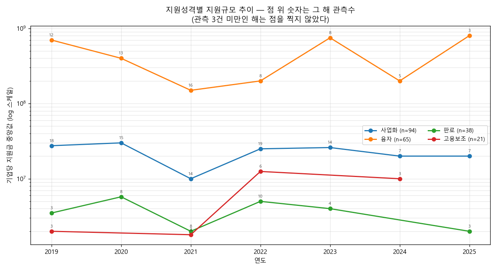

# 지원규모의 연도별 증감 추이

지원성격 축과 대분류 축으로 같은 질문을 두 번 재고, 결론이 갈리면 그것도 적는다.

> **출처 통제** — 관측 출처가 연도로 갈린다(2019~2025 층화표본 / 2026 전량).
> 이어 붙이면 '표본→전수' 전환이 증감으로 둔갑하므로, 추세는 2019~2025 로만 재고
> 2026 은 다른 기준의 참고치로 따로 낸다.

## 지원성격 × 연도

| 지원성격 | 2019 | 2020 | 2021 | 2022 | 2023 | 2024 | 2025 | 전체 n |
|---|---|---|---|---|---|---|---|---|
| 사업화 | 2,750만원 (18) | 3,000만원 (15) | 1,000만원 (14) | 2,500만원 (19) | 2,600만원 (14) | 2,000만원 (7) | 2,000만원 (7) | 94 |
| 융자 | 7.0억원 (12) | 4.0억원 (13) | 1.5억원 (16) | 2.0억원 (8) | 7.5억원 (8) | 2.0억원 (5) | 8.0억원 (3) | 65 |
| 판로 | 350만원 (3) | 575만원 (8) | 200만원 (8) | 500만원 (10) | 400만원 (4) | — (2) | 200만원 (3) | 38 |
| 고용보조 | 200만원 (3) | — (2) | 180만원 (3) | 1,250만원 (6) | — (2) | 1,000만원 (3) | — (2) | 21 |
| 컨설팅 | 200만원 (4) | — (1) | — (0) | — (1) | — (2) | — (1) | 450만원 (5) | 14 |
| 설비 | 3.0억원 (3) | — (0) | — (1) | — (0) | — (2) | — (2) | — (2) | 10 |
| 연구개발 | — (1) | — (0) | — (2) | — (2) | — (0) | — (1) | — (0) | 6 |
| 창업보육 | — (1) | — (0) | — (1) | — (0) | — (1) | — (0) | — (1) | 4 |
| 해외인증 | — (1) | — (0) | — (0) | — (0) | — (1) | — (0) | — (1) | 3 |
| 교육훈련 | — (1) | — (0) | — (0) | — (0) | — (0) | — (0) | — (0) | 1 |
| SW·솔루션 | — (0) | — (1) | — (0) | — (0) | — (0) | — (0) | — (0) | 1 |
| 경진대회 | — (0) | — (0) | — (0) | — (0) | — (1) | — (0) | — (0) | 1 |

| 지원성격 | n | rho | p | q(BH) | 판정 |
|---|---:|---:|---:|---:|---|
| 컨설팅 | 14 | 0.338 | 0.2371 | 0.7571 | 추세없음 |
| 판로 | 38 | -0.151 | 0.3661 | 0.7571 | 추세없음 |
| 사업화 | 94 | -0.066 | 0.5258 | 0.7571 | 추세없음 |
| 융자 | 65 | -0.058 | 0.6470 | 0.7571 | 추세없음 |
| 고용보조 | 21 | 0.072 | 0.7571 | 0.7571 | 추세없음 |

## 지원성격 × 기간 (연 단위가 얇아 묶어서 재검정)

| 지원성격 | 전반(~2021) | 후반(2022~) | 배수 | p | q(BH) | 판정 |
|---|---:|---:|---:|---:|---:|---|
| 컨설팅 | 200만원 (5) | 450만원 (9) | 2.25 | 0.1601 | 0.8006 | 변화없음 |
| 고용보조 | 190만원 (8) | 1,000만원 (13) | 5.26 | 0.3641 | 0.9102 | 변화없음 |
| 융자 | 3.0억원 (41) | 4.5억원 (24) | 1.50 | 0.7529 | 0.9667 | 변화없음 |
| 판로 | 260만원 (19) | 300만원 (19) | 1.15 | 0.9180 | 0.9667 | 변화없음 |
| 사업화 | 2,000만원 (47) | 2,000만원 (47) | 1.00 | 0.9667 | 0.9667 | 변화없음 |

## 대분류 × 연도

| 대분류 | 2019 | 2020 | 2021 | 2022 | 2023 | 2024 | 2025 | 전체 n |
|---|---|---|---|---|---|---|---|---|
| 금융 | 4.5억원 (20) | 3.0억원 (27) | 2.0억원 (24) | 2.0억원 (14) | 5.0억원 (17) | 2.0억원 (10) | 2.5억원 (12) | 124 |
| 수출 | 400만원 (11) | 550만원 (13) | 500만원 (11) | 2,000만원 (17) | 3,000만원 (11) | 5,000만원 (5) | 175만원 (4) | 72 |
| 경영 | 2,500만원 (11) | 900만원 (9) | 2,000만원 (12) | 2,000만원 (9) | 3,000만원 (9) | 2,000만원 (5) | 2,000만원 (8) | 63 |
| 기술 | 4,500만원 (11) | 2,250만원 (10) | 1,050만원 (7) | 2,000만원 (14) | 1,080만원 (7) | — (2) | 1,000만원 (9) | 60 |
| 창업 | 1,000만원 (5) | 700만원 (6) | 1,000만원 (7) | 4,600만원 (10) | 500만원 (11) | 1,000만원 (6) | 1,600만원 (3) | 48 |
| 내수 | 330만원 (10) | 850만원 (8) | 200만원 (6) | 700만원 (10) | 1,100만원 (6) | 300만원 (5) | 200만원 (3) | 48 |
| 인력 | 400만원 (6) | 300만원 (5) | 390만원 (4) | 1,250만원 (4) | 500만원 (11) | 1,000만원 (5) | 1,450만원 (6) | 41 |
| 기타 | 2,500만원 (7) | 750만원 (6) | 1.5억원 (3) | 200만원 (5) | 425만원 (4) | 2,000만원 (4) | — (0) | 29 |

| 대분류 | n | rho | p | q(BH) | 판정 |
|---|---:|---:|---:|---:|---|
| 기술 | 60 | -0.365 | 0.0042 | 0.0333 | 감소 |
| 인력 | 41 | 0.323 | 0.0398 | 0.1590 | 증가(약함) |
| 수출 | 72 | 0.166 | 0.1643 | 0.4090 | 추세없음 |
| 기타 | 29 | -0.243 | 0.2045 | 0.4090 | 추세없음 |
| 금융 | 124 | -0.084 | 0.3539 | 0.5662 | 추세없음 |
| 창업 | 48 | 0.051 | 0.7320 | 0.8583 | 추세없음 |
| 내수 | 48 | 0.028 | 0.8501 | 0.8583 | 추세없음 |
| 경영 | 63 | -0.023 | 0.8583 | 0.8583 | 추세없음 |

## 전체 pooled

| 연도 | 중앙값 | 관측수 |
|---|---:|---:|
| 2019 | 2,000만원 | 81 |
| 2020 | 1,350만원 | 84 |
| 2021 | 2,000만원 | 74 |
| 2022 | 2,000만원 | 83 |
| 2023 | 2,000만원 | 76 |
| 2024 | 2,000만원 | 42 |
| 2025 | 1,600만원 | 45 |

rho -0.039 / p 0.3917 → **추세없음**

## 검정력

- log10 금액 표준편차 0.966, 연평균 관측 69건
- 연도별 중앙값의 표준오차 0.116 (log10) → **연간 69% 미만의 변화는 탐지 불가**
- 따라서 '추세 없음'은 '변화가 없다'가 아니라 '이 표본으로는 못 본다'로 읽어야 한다.

## 2026 참고치 (Open API 전량 — 기준이 다름)

| 지원성격 | 중앙값 | 관측수 |
|---|---:|---:|
| 융자 | 2.0억원 | 33 |
| 사업화 | 1,750만원 | 22 |
| 컨설팅 | 1,300만원 | 17 |
| 해외인증 | 1,000만원 | 7 |
| 고용보조 | 900만원 | 11 |
| 판로 | 300만원 | 20 |
| 연구개발 | 250만원 | 8 |