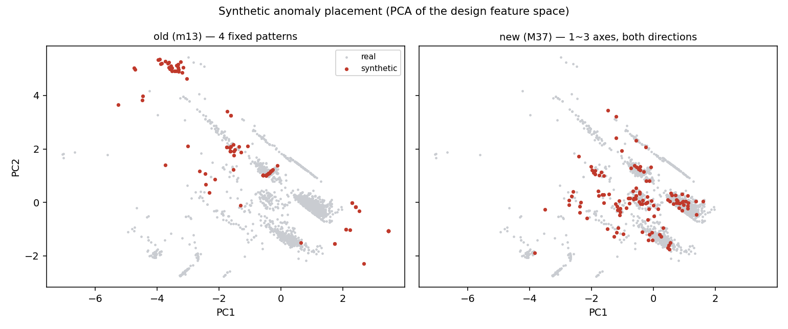

# M37 — 합성 이상치 재설계와 뭉침 검사

> 계획서 §3. 합성 이상치가 몇 개 덩어리로 몰리면 모델은 실제 이상 구조가
> 아니라 **생성 규칙 자체**를 외웁니다. 규칙을 흩뜨리고, 실제로 흩어졌는지
> 검사합니다.

> **Step 8 을 Step 7 보다 먼저 했습니다.** Vector Direction 은 거리와 방향을
> 섞는 가중치를 정해야 하는데, 계획서 §6 이 "human hold-out 으로 weight 를
> 선택하면 안 된다"고 못박았습니다. 고를 근거가 될 validation 이 먼저
> 있어야 합니다.

## 1. 두 생성기

| | old (m13) | new (M37) |
|---|---|---|
| 방식 | 4개 고정 패턴 | 1~3개 축 무작위 선택 |
| 이동 | `train 최댓값 + 1.0` 로 분포 밖 고정 | 배수표에서 추첨, 자릿수 유지 |
| 방향 | 사실상 한 방향 | 증가·감소 양방향 |
| 규칙 종류 | 4 | **77** |

변경 축 개수 분포 (new): `{'1': 63, '2': 41, '3': 13}`

## 2. 뭉침 검사 (계획서 §3.3)

| 지표 | old | new | 읽는 법 |
|---|---:|---:|---|
| kNN 순도 | 0.987 | 0.209 | 합성 점의 이웃 10개 중 합성 비율. 무작위 배치면 0.057 근처, 1.0 이면 완전히 뭉친 것 |
| 합성 퍼짐 / 정상 퍼짐 | 3.934 | 1.063 | 1 보다 크게 작으면 합성끼리 좁게 모여 있다 |
| 생성규칙 실루엣 | 0.5273 | -0.2511 | 0.5 이상이면 규칙끼리 군집을 이뤄 규칙을 외울 수 있다 |



## 3. 같은 모델이 두 합성셋을 얼마나 잡는가

합성셋을 바꾸면 회수율이 바뀝니다. 그 차이가 곧 **기존 수치가 생성 규칙에
얼마나 기대고 있었는가** 입니다.

| 모델 | old 회수율 | new 회수율 | 차이 |
|---|---:|---:|---:|
| OneClassSVM | 1.000 | 0.444 | -0.556 |
| IsolationForest | 0.392 | 0.103 | -0.289 |
| LocalOutlierFactor | 0.758 | 0.137 | -0.621 |

## 4. 이 합성셋으로 하는 것과 하지 않는 것

```text
한다     Vector Direction 의 거리·방향 가중치 선택 (M38)
         모델 robustness 검사
안 한다  최종 성능 보고 — 그건 clean human hold-out 몫이다 (계획서 §13)
```
