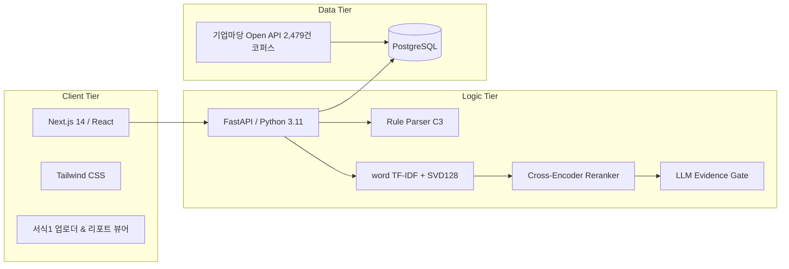

# SK네트웍스 Family AI 캠프 30기 4팀 중간 발표회
## 중소기업 지원사업 사전협의 Pre-review 분석 모듈 (Decision-support Layer)

---

## 📌 문서 정보 (Document Metadata)

| 항목 | 내용 |
| :--- | :--- |
| **프로젝트 세부 주제** | 중소기업 지원사업 사전협의 Pre-review 분석 모듈 |
| **서비스 정의** | 제출 전에 쟁점을 먼저 확인하는 Decision-support 분석 레이어 |
| **기수 및 팀명** | SK네트웍스 Family AI 캠프 30기 · 4팀 |
| **발표자 및 팀원** | **발표자:** 김도훈 \| **팀원:** 5인 전문화 R&R 팀 (PM/기획, Data, AI/ML, Back-end, Front-end) |
| **개발 기간** | 2026. 07. 21. ~ 2026. 09. 08. (총 7주) |
| **발표일자** | 2026. 08. 18. (중간 발표회) |

---

## 📑 목차 (CONTENTS)

- [PART 01. 프로젝트 개요](#part-01-프로젝트-개요)
  - [01. 프로젝트 개요 및 기획 배경](#01-프로젝트-개요-및-기획-배경)
  - [02. 프로젝트 주요 기능 (4단계 분석 파이프라인)](#02-프로젝트-주요-기능-4단계-분석-파이프라인)
  - [03. 기술 스택 및 개발 환경](#03-기술-스택-및-개발-환경)
  - [04. 팀원 역할 분담 (R&R) 및 담당 파트](#04-팀원-역할-분담-rr-및-담당-파트)
- [PART 02. 진행 현황](#part-02-진행-현황)
  - [05. WBS 기반 개발 일정 및 진행 현황 전반 (62%)](#05-wbs-기반-개발-일정-및-진행-현황-전반-62)
  - [06. 이슈 사항 및 트러블슈팅 (Troubleshooting)](#06-이슈-사항-및-트러블슈팅-troubleshooting)
- [PART 03. 예상 결과 목표](#part-03-예상-결과-목표)
  - [07. 최종 결과 목표 및 서비스 완성도 기준](#07-최종-결과-목표-및-서비스-완성도-기준)
  - [08. 기타 및 추후 고도화 계획](#08-기타-및-추후-고도화-계획)
- [마무리](#마무리)
  - [09. Q & A (질의응답)](#09-q--a-질의응답)
  - [10. Thank You (감사의 인사)](#10-thank-you-감사의-인사)

---

# PART 01. 프로젝트 개요

> **신규·변경 중소기업 지원사업 사전협의 전, 사업기획안의 완성도를 점검하고 기존 사업과의 유사·중복 쟁점과 근거를 사전에 확인하는 의사결정 지원 분석 레이어**

---

### 01. 프로젝트 개요 및 기획 배경

#### 1) 프로젝트 명칭 및 정의
- **프로젝트 명칭:** 중소기업 지원사업 사전협의 Pre-review 분석 모듈
- **기획 의도:** 지자체 사업기획 담당자가 정식 사전협의를 제출하기 전, 사전협의 요청서(서식1)를 스스로 점검하고 기존 지원사업과의 **유사·중복 쟁점과 원문 근거**를 사전에 확인하여 보완할 수 있도록 지원하는 **Decision-support 분석 레이어**입니다.

#### 2) 기획 배경 및 문제의 실재성
1. **법정 의무 절차 (`「중소기업기본법」 제20조의3`):**
   - 중앙부처 및 지자체가 중소기업 지원사업을 신설하거나 변경할 경우, 사업 간 역할분담·연계 강화와 중복성 검토를 위해 중기부와 사전협의를 거쳐야 하는 법정 의무 제도입니다.
2. **반복되는 사후 보완 Loop (`51.5% 사업조정률`):**
   - 2019~2021년 사전협의 대상 592개 사업 중 **305건(51.5%)**에서 실제 사업내용 조정 및 보완 요구가 발생했습니다.
   - 2021년 신설·변경 사업 160건 중 **47%(75건)**가 권고·재협의·조정 판정을 받아 기획-검토 간 피로도가 누적되고 있습니다.
3. **8대 공식 검토축의 복합성:**
   - 단순 키워드 유사 여부가 아닌 ① 사업 필요성, ② 대상 적합성, ③ 기존사업 관계, ④ 중복수혜 가능성, ⑤ 차별화, ⑥ 역할분담·연계, ⑦ 성과지표 정합성, ⑧ 수행체계 등 8개 축을 종합적으로 고려해야 하므로 제출 전 자체 점검이 어렵습니다.

> 🎤 **발표 대본 가이드:**  
> "중소기업기본법상 신설·변경 사업의 사전협의는 법정 의무이나, 2019~2021년 592개 사업 중 51.5%에서 사업내용 조정이 발생했습니다. 8대 검토축을 사전에 점검하여 최초 제출안의 준비도(First-pass Quality)를 높이는 것이 본 프로젝트의 기획 의도입니다."

---

### 02. 프로젝트 주요 기능 (4단계 분석 파이프라인)

본 서비스는 사업기획안이 쟁점으로 정리되는 **4단계 분석 파이프라인**을 제공합니다.

| 단계 | 주요 기능명 | 상세 제공 내용 | 통제 및 검증 기준 |
| :---: | :--- | :--- | :--- |
| **01** | **사업안 구조화 & 완전성 점검** | 사전협의 요청서(서식1)에서 목적, 대상, 내용, 규모, 수행체계, 성과목표 등 7대 핵심 요소를 자동 추출 | 규칙 기반 완전성(Completeness) 및 내부 정합성(Consistency) 스크리닝 |
| **02** | **유사 사업 추천 (Retrieval)** | 신규 사업안의 의미·구조를 기준으로 기업마당 실공고 코퍼스(2,479건)에서 관련 기존사업 후보 Top-N 압축 | **word TF-IDF + SVD 128차원** (Recall@5: 0.795) |
| **03** | **공식 검토축 항목별 비교** | 목적, 지원대상, 지원내용, 수행체계를 동일 기준선에서 1:1 비교 매트릭스로 대조 | 실측 데이터 가용성 기반 비교 (지원방식, 규모, 지역, 성과목표 확장) |
| **04** | **쟁점 탐지 & 원문 근거 연결** | 중복수혜 위험, 차별화 필요 지점 식별 및 판단 근거 원문 문장 연결 (**Evidence Trace**) | **Pre-review 검토요약서 자동 발행** (모든 출력은 확정 판정이 아닌 “보완·확인 필요” 형태로 표현) |

> 🎤 **발표 대본 가이드:**  
> "사업기획안이 쟁점으로 정리되는 4단계 분석 파이프라인을 제공합니다. 1단계 사업안 구조화 및 완전성 점검, 2단계 실공고 코퍼스 기반 유사사업 추천, 3단계 공식 검토축 1:1 비교, 4단계 쟁점 탐지 및 원문 Evidence Trace 매핑입니다."

---

### 03. 기술 스택 및 개발 환경

3-Tier 아키텍처를 기반으로 설계되었습니다.



- **Front-end:** Next.js 14 (App Router), React, Tailwind CSS
  - 서식1 업로더, 1:1 비교 테이블, 원문 하이라이트 뷰어, PDF 리포트 렌더러
- **Back-end & AI:** Python 3.11, FastAPI, Uvicorn
  - 정보 검색(IR): word TF-IDF + SVD 128차원
  - 리랭킹 & 요건추출: Cross-Encoder & Rule Parser
  - 품질 통제: LLM Evidence Gate (원문 1:1 매핑 필터링)
- **Data & Infra:** PostgreSQL, Docker, Git / GitHub
  - 원천 데이터: 공공데이터포털 기업마당 Open API 수집 코퍼스 2,479건

> 🎤 **발표 대본 가이드:**  
> "Next.js 14 기반 반응형 웹 대시보드로 서식1 업로드와 비교 리포트를 제공하며, FastAPI 기반으로 word TF-IDF + SVD128 검색 모델과 Evidence Gate를 구동합니다. 데이터는 기업마당 2,479건 실공고 코퍼스를 활용합니다."

---

### 04. 팀원 역할 분담 (R&R) 및 담당 파트

5인의 전문 R&R 체계로 구성되어 15대 공식 산출물을 각 3개씩 분담하여 책임 개발을 수행합니다.

| 포지션 | 담당자 | 주요 역할 및 책임 (R&R) | 담당 공식 산출물 |
| :--- | :---: | :--- | :--- |
| **PM / 서비스 기획** | **팀원 A (팀장)** | • 사전협의 제도 및 업무 프로세스 분석<br />• PRD, WBS 공정표 관리 및 쟁점 Taxonomy 수립 | 요구사항 정의서, WBS 공정표, 서비스 기획서 |
| **Data Engineer** | **팀원 B** | • 기업마당 Open API 수집 자동화 및 데이터 전처리<br />• PostgreSQL 코퍼스 DB 구축 및 스키마 설계 | 데이터 수집/정제 보고서, DB 설계서, 데이터 파이프라인 정의서 |
| **AI / ML Engineer** | **팀원 C** | • word+SVD128 모델 실측 튜닝 및 성능 검증<br />• Cross-Encoder 리랭커 및 요건 NER 골드셋 구축 | ML/DL 모델 학습 보고서, 모델 평가서, 모델 바이너리/코드 |
| **Back-end Engineer** | **팀원 D** | • FastAPI 분석 파이프라인 개발<br />• 서식1 C3 규칙 파서 및 원문 Evidence Gate 연동 | 시스템 아키텍처 설계서, API 명세서, 테스트 결과 보고서 |
| **Front-end Engineer** | **팀원 E** | • Next.js 14 반응형 UI 컴포넌트 개발<br />• 서식1 업로드, 1:1 비교 화면 및 검토요약 리포트 구현 | 화면 설계서 (와이어프레임), UI 컴포넌트 명세서, 웹 애플리케이션 산출물 |

> 🎤 **발표 대본 가이드:**  
> "5인의 전문 R&R 체계로 운영되며, PM/기획, Data Engineer, AI/ML Engineer, Back-end, Front-end 포지션에 걸쳐 15대 공식 산출물을 각 3개씩 분담하여 책임 개발을 수행하고 있습니다."

---

# PART 02. 진행 현황

> **7주간 마일스톤 공정표에 따른 추진 현황 및 실측 데이터 검증을 통해 달성한 핵심 트러블슈팅**

---

### 05. WBS 기반 개발 일정 및 진행 현황 전반 (62%)

총 7주 개발 일정 중 현재 **4주차(중간점검 시점) 기준 전체 공정률 62%를 온트랙(On-Track)**으로 달성하였습니다.

```
[Phase 1] 기획 및 스키마 설계 (1~2주차)   : [████████████████████] 100% 완료 ✅
[Phase 2] 공공데이터 수집/적재 (3주차)    : [████████████████████] 100% 완료 ✅
[Phase 3] Retrieval 모델/규칙 파서 (4주차): [██████████████████░░]  90% 진행중 ⚡ (현재)
[Phase 4] Evidence Gate / API (5주차)     : [███░░░░░░░░░░░░░░░░░]  15% 예정 ⏳
[Phase 5] UI 연동 / E2E 테스트 (6~7주차)  : [░░░░░░░░░░░░░░░░░░░░]   0% 예정 ⏳
```

- **완료 마일스톤:**
  - `M1`: 사전협의 업무 요건 분석 및 서비스 기획서 v0.2.2 확정 (100%)
  - `M2`: 기업마당 Open API 2,479건 수집 및 PostgreSQL DB 스키마 구축 (100%)
  - `M3`: 서식1 C3 규칙 파서 초안 및 word+SVD128 검색 베이스라인 튜닝 (90%)
- **향후 마일스톤:**
  - `M4`: LLM Evidence Gate 연동 및 FastAPI 종합 분석 파이프라인 통합 (5주차)
  - `M5`: Next.js UI 연동, PDF 리포트 발행, E2E 통합 테스트 및 최종 배포 (6~7주차)

> 🎤 **발표 대본 가이드:**  
> "총 5개 Phase 중 Phase 1 기획 및 DB 설계와 Phase 2 공공데이터 수집을 100% 완료하였으며, 현재 Phase 3 Retrieval 모델 실측 튜닝 및 규칙 파서 개발을 90% 완료하여 전체 공정률 62%로 온트랙 달성 중입니다."

---

### 06. 이슈 사항 및 트러블슈팅 (Troubleshooting)

실측 데이터를 기반으로 문제를 조기에 식별하고 방향을 수정한 3대 트러블슈팅 사례입니다.

| 구분 | 발생 이슈 및 병목 현상 | 원인 분석 (Root Cause) | 해결 방법 및 조치 결과 |
| :---: | :--- | :--- | :--- |
| **이슈 01**<br />`데이터 결함` | **합성 학습 데이터셋 6종 결함 발견** | 접두사 형식 누출(100%) 및 문자 일치율 0.922 등 무작위 분할 시 정답이 누출되는 치명적 데이터 오염 실측 확인 | **합성 6종 전량 학습 데이터셋에서 배제** ➔ 실공고 2,479건 코퍼스 + 소규모 골드셋 검증으로 전환 |
| **이슈 02**<br />`모델 역방향` | **이상탐지(Anomaly Detection) 모델의 구조적 한계** | 신규 정책 사업을 이상치(Anomaly)로 오판하고, 정작 핵심 쟁점인 유사·중복 사업은 데이터 분포 중심에 위치하여 탐지 실패 | **이상탐지 모델 전면 폐기** ➔ 실질 기여도가 입증된 **Retrieval(word+SVD128, Recall@5: 0.795) 단일화**로 ML 역량 집중 |
| **이슈 03**<br />`LLM 환각` | **근거 없는 쟁점 과다 생성 (Hallucination)** | 범용 LLM 적용 시 원문에 없는 가상의 유사 쟁점을 날조하거나 확정 판정 어휘를 임의로 출력하는 문제 발생 | 신규안 문장과 공고문 원문 위치가 1:1 매핑된 쟁점만 통과시키는 **Evidence Gate 구축** + 정보 부족 축은 '추가 자료 필요'로 통제 |

> 🎤 **발표 대본 가이드:**  
> "첫째, 합성 데이터셋 6종의 형식 누출 결함을 실측 확인하여 전량 폐기하고 실공고 코퍼스로 전환했습니다. 둘째, 이상탐지 방식이 신규 정책을 오류로 오판하는 구조적 결함을 확인하여 실질 기여도가 높은 Retrieval 단일화로 전환했습니다. 셋째, 원문 위치가 1:1 매핑된 쟁점만 출력하는 Evidence Gate로 환각을 통제했습니다."

---

# PART 03. 예상 결과 목표

> **최종 데모 시연 목표치 및 서비스 완성도 기준과 중소기업 빅데이터(SIMS) 연계 및 추후 고도화 계획**

---

### 07. 최종 결과 목표 및 서비스 완성도 기준

#### 1) 5대 정량적 핵심 지표 (Quantitative KPIs)
- 🎯 **후보 검색 성능 (Retrieval):** `Recall@5 > 0.85`, `MRR > 0.65` 달성 (베이스라인 0.652 대비 대폭 향상)
- 🎯 **완전성 점검 신뢰도:** 서식1 필수항목 누락 및 모호성 탐지율 `100%` 보증 (C3 규칙 파서)
- 🎯 **근거 매핑 정확도:** 쟁점과 원문 간 `Evidence Coverage > 95%` 달성 (근거 없는 쟁점 배제)
- 🎯 **출력 통제:** 핵심 쟁점 `Top-3` 압축 제시 (사용자 인지 과부하 방지)
- 🎯 **분석 응답 속도:** E2E 리포트 생성 시간 `< 15초` 이내

#### 2) 최종 데모 시연 시나리오 (End-to-End User Flow)
1. **사업기획안 입력:** 지자체 기획자가 신규 지원사업 기획서(서식1 또는 PDF/한글 문서) 업로드
2. **자동 구조화 & 스크리닝:** 7대 핵심 요소 추출 및 완전성/정합성 결측 알림 확인
3. **유사사업 1:1 비교:** 기업마당 코퍼스에서 추천된 Top-5 유사사업과의 공식 검토축 비교표 조회
4. **쟁점 & 근거 확인:** 중복수혜/차별화 쟁점과 하이라이트된 원문 증빙(Evidence Trace) 확인
5. **검토요약서 발행:** 보완 사항을 반영한 **Pre-review 검토요약서 PDF** 원클릭 생성

> 🎤 **발표 대본 가이드:**  
> "Retrieval 검색 성능 Recall@5 0.85 이상, 필수항목 누락 탐지율 100%, 쟁점 원문 근거 매핑율 95% 이상, 리포트 생성 소요시간 15초 이내를 달성하여 실제 지자체 사업기획서 입력부터 검토요약서 PDF 발행까지 완성도 높은 E2E 시연을 완수할 계획입니다."

---

### 08. 기타 및 추후 고도화 계획

- 🚀 **고도화 01. 공고문 첨부파일(HWP/PDF) 정밀 OCR 파서 연동**
  - 현재 공고 본문 중심 수집에서 첨부파일(HWP/PDF) 상세 파싱을 확대하여 지원규모, 지원방식, 사업기간 등 조건부 비교축 커버리지를 60% 이상으로 확대
- 🚀 **고도화 02. 검토자용 공통 뷰어 확장**
  - 기획자가 생성한 구조화 정보, 비교대상, Evidence Trace를 사전협의 전담기관 및 검토 담당자가 원클릭으로 열람·재활용하는 협업 뷰어 구축
- 🚀 **고도화 03. 중소기업 빅데이터 플랫폼(SIMS) 분석 레이어 편입**
  - SIMS 및 사전협의 온라인 시스템에 제출 전 사전 스크리닝 플러그인 모듈로 편입하여 행정 프로세스 전반의 효율 극대화

> 🎤 **발표 대본 가이드:**  
> "첫째, 공고문 첨부파일(HWP/PDF) 정밀 OCR 파서를 연동하여 조건부 비교축 커버리지를 60% 이상으로 확대하겠습니다. 둘째, 검토자용 공유 뷰어를 구현하여 기획자의 분석 결과를 검토자가 원클릭으로 재활용하도록 확장하겠습니다. 셋째, 장기적으로 SIMS 내부 분석 레이어로 연계를 추진하겠습니다."

---

# 마무리

---

### 09. Q & A (질의응답)

#### Ask Us Anything (핵심 FAQ 3선)

1. **Q. 사용한 데이터의 출처와 규모는 어떻게 되나요?**
   - **A.** 공공데이터포털 기업마당 Open API를 통해 수집된 중앙부처 및 지자체 실공고 코퍼스 **2,479건**의 본문 및 메타데이터를 정제하여 구축하였습니다.
2. **Q. 머신러닝(ML) 개발 범위를 Retrieval(검색)에 집중한 이유는 무엇인가요?**
   - **A.** 실측 검증 결과 합성 데이터의 정답 누출 결함과 이상탐지의 신규 정책 오판 한계를 확인하여, 실질적 기여도와 효용이 확실한 관련사업 검색(Retrieval) 모델 최적화에 집중했습니다.
3. **Q. LLM 환각(Hallucination)에 대한 방지 정책은 무엇인가요?**
   - **A.** 신규 사업안 문장과 기존 공고문 원문 위치가 1:1로 정확히 연결된 쟁점만 출력하는 **Evidence Gate**를 적용하고 있으며, 데이터가 부족한 축은 무리한 추론 대신 **'추가 자료 필요'**로 안전하게 통제합니다.

> 🎤 **발표 대본 가이드:**  
> "데이터 출처 및 코퍼스 구축, word+SVD128 모델링 근거, 환각 방지 Evidence Gate 등 프로젝트 전반에 대한 질문에 성실히 답변드리겠습니다."

---

### 10. Thank You (감사의 인사)

> **중소기업 지원사업 사전협의 Pre-review 분석 모듈**  
> **SK네트웍스 Family AI 캠프 30기 · 4팀**  
> 발표자: 김도훈 | 팀원: 5인 R&R 전문화 팀  
> 
> *경청해 주셔서 대단히 감사합니다.*
